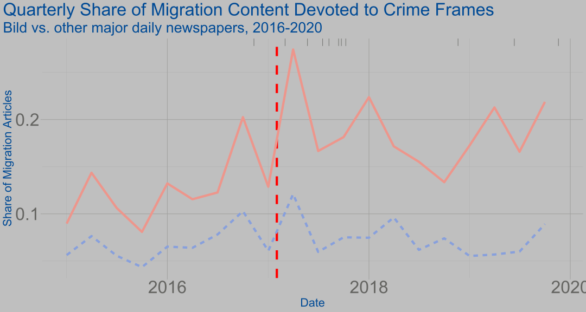

# Estimating the impact of media frames on issue definitions

Does news framing affect public opinion? While a large body of experimental work suggests that individual attitudes can be easily altered by emphasizing different aspects of an issue, little is known about how these studies generalize to real world environments. I exploit a rare change in the migration framing of the major German tabloid *Bild* to bridge this gap. In a first step, I develop a framework for the measurement of emphasis frames in political communication using supervised machine learning. Using this framework, I show that the emphasis of crime in *Bild*'s migration coverage severely increased following an exogenously timed change of editor. Second, I employ a difference-in-differences design using panel data from over 16,000 individuals in thirteen waves to assess the precise impact of this shift on migration attitudes. Despite a major change in migration framing, a robust null effect on immigration attitudes and a number of related variables can be observed. These findings caution against the generalization of experimental framing studies to real-world environments and open a broader research agenda to study the precise impact of political communication beyond the experimental setting.

<!--  -->
