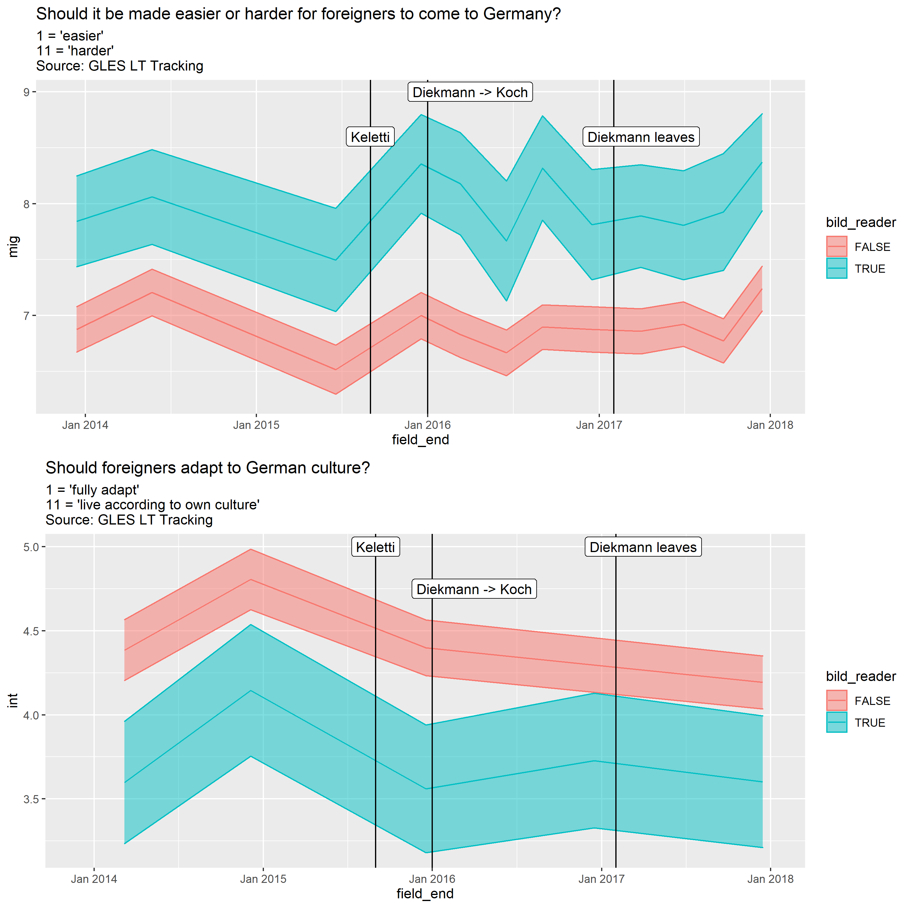

# Estimating the impact of media frames on issue definitions

Classic theories of opinion formation assume that attitudes can be changed by manipulating the considerations associated with an issue. However, this assumption has not been investigated in real-world environments. I test it by exploiting a major shift in migration framing in the largest German tabloid, Bild. Making use of panel data and recent developments in text analysis, I show that changing frames in news content causally affect both issue attitudes and issue definitions. This has important implications for the study of opinion formation, the role of the news media in it, and the external validity of framing effects.

<!--  -->
