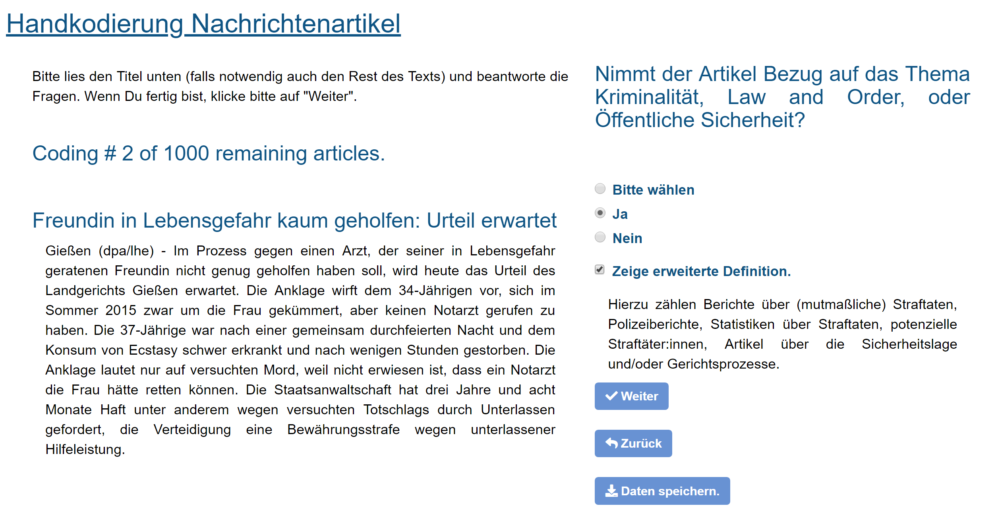

```{r setup, include=FALSE, cache=FALSE}
knitr::opts_chunk$set(echo = F, message = F, warning = F, cache = T, fig.height=6, 
                      fig.width=10, fig.align='center', fig.pos = "!htp", out.extra = "")

library(tidyverse)
library(dplyr)
library(data.table)
library(here)
library(patchwork)

# load self-made functions
for (filename in list.files(here("code/functions"))){
  source(here(paste0('code/functions/', filename)))
}
```

# Variables & Decriptives

## Dependent Variables

### Overview


Treated Group: Bild Readers in first (and only pre-treatment) wave. Control Group: Never-Readers of Bild. Post Date: $>=$ 01.02.2017

```{r bild_descriptives, results = "asis"}

gles_p_long <- fread(here('data/raw/gles/Panel/long_cleaned.csv'))

desc <- 
  gles_p_long %>% 
  filter(wave == "1", !is.na(treat)) %>% 
  group_by(treat) %>% 
  select(gender_clean, ybirth_clean, `010_clean`, 
         `1130_clean`, `1500_clean`, `afd_vote`, `430i_clean`) %>%
  mutate(gender_clean = gender_clean-1) %>% 
  mutate(across(.fns = as.integer)) %>% 
  summarise(across(.fns = mean, na.rm = T)) %>% 
  select(-treat) %>% 
  t() %>% round(2)

colnames(desc) <- c("Control", "Treatment")
row.names(desc) <- c("Gender (0 = m, 1 = f)", "Birthyear", 
                     "Political interest (1, 5)", "Immigration Attitude (-3, 3)",
                     "General left-right (0-10)", "Share of AfD supporters", "AfD attitude (-5, 5)")

knitr::kable(desc, align = c("c", "c"))

rm(gles_p_long, desc)

```

Note that the variable "Birthyear" is left-censored in the data. All respondents born before 1955 were assigned 1955 as birth year.

Table, treated vs. untreated

### Immigration Attitudes (1130 in GLES)

#### Question Text

*Translated:*

Now it's about immigration opportunities for foreigners. Should immigration opportunities for foreigners be made easier or restricted?

(1) Make it easier for foreigners to move here
(2)
(3)
(4)
(5)
(6)
(7) Restrict immigration of foreigners

*Recoded to [-3, 3].*

---

*Original/DE:*

Jetzt geht es um Zuzugsmöglichkeiten für Ausländer. Sollten die Zuzugsmöglichkeiten für Ausländer erleichtert oder eingeschränkt werden?

(1) Zuzug von Ausländern erleichtern
(2)
(3)
(4)
(5)
(6)
(7) Zuzug von Ausländern einschränken

#### Distribution

```{r}

GroupedDistPlot("1130_clean",
                header = "Distribution of Immigration Attitudes")

```


### Integration Attitudes (1210 in GLES)

#### Question Text

*Translated:*

There are different opinions about how much foreigners in Germany should adapt. Some think that foreigners should fully assimilate to German culture. Others think that foreigners should be able to live according to their own culture if possible.

(1) Foreigners should fully assimilate to German culture
(2)
(3)
(4)
(5)
(6)
(7) Foreigners should, if possible, be able to live according to their own culture

*Recoded to [-3, 3].*

---

*Original/DE:*

Es gibt unterschiedliche Auffassungen darüber, wie sehr sich Ausländer in Deutschland anpassen sollten. Manche denken, dass sich Ausländer vollständig an die deutsche Kultur anpassen sollten. Andere denken, Ausländer sollten auch hier möglichst nach der eigenen Kultur leben können.

(1) Ausländer sollten sich vollständig an die deutsche Kultur anpassen
(2) 
(3) 
(4) 
(5) 
(6) 
(7) Ausländer sollten möglichst nach eigener Kultur leben können


#### Distribution

```{r}


GroupedDistPlot("1210_clean",
                header = "Distribution of Integration Attitudes")

```


### MIP: Immigration (840 in GLES)

#### Question Text

*Translated:*

In your opinion, what is the most important political problem in Germany at the moment?
Please name only one *single* problem.

*0/1 indicator assessing mention of any migration related code (3411-3413 or 3750-3759; find coding scheme on GLES website).*

---

*Original/DE:*

Was ist Ihrer Meinung nach gegenwärtig das wichtigste politische Problem in Deutschland? 
Hinweistext: Nennen Sie bitte nur ein *einziges* Problem.  

#### Distribution

```{r}

gles_p_long <- fread(here('data/raw/gles/Panel/long_cleaned.csv'))
  
gles_p_long[["dv"]] <- gles_p_long[["mip_mig"]]

p_upper <- 
  gles_p_long %>% 
  filter(treat, !is.na(dv)) %>% 
  ggplot(aes(dv)) +
  geom_bar(aes(y = (..count..)/sum(..count..)),
           fill = MetBrewer::met.brewer("Archambault")[4]) +
  theme_minimal() +
  xlab("") + ylab("Share") +
  ggtitle("Mention of Migration as Most Important Problem", "Bild Readers")

p_lower <- 
  gles_p_long %>% 
  filter(!treat, !is.na(dv)) %>% 
  ggplot(aes(dv)) +
  geom_bar(aes(y = (..count..)/sum(..count..)),
           fill = MetBrewer::met.brewer("Archambault")[1]) +
  theme_minimal() +
  xlab("") + ylab("Share") +
  ggtitle("", "Never Bild Readers")

p_upper / p_lower


rm(gles_p_long)

```


### AfD Scalometer (430i in GLES)

#### Question Text

*Translated:*

What do you think of the individual political parties in general? AfD (Alternative for Germany)

(1) -5 don't think much of the party at all
(2) -4
(3) -3
(4) -2
(5) -1
(6) 0
(7) +1
(8) +2
(9) +3
(10) +4
(11) +5 think very highly of the party
 
(-71) I don't know [labeled as "not known" in the data set]

*Recoded to [-5, 5].*

---

*Original/DE:*

Was halten Sie so ganz allgemein von den einzelnen politischen Parteien? AfD (Alternative für Deutschland)

(1) -5 halte überhaupt nichts von der Partei 
(2) -4 
(3) -3 
(4) -2 
(5) -1 
(6) 0 
(7) +1 
(8) +2 
(9) +3 
(10) +4 
(11) +5 halte sehr viel von der Partei 
 
(-71) kenne ich nicht [im Datensatz gelabelt als „nicht bekannt“]

#### Distribution

```{r}

GroupedDistPlot("430i_clean",
                header = "Distribution of Attitude Towards AfD")


```


### Attitude towards fighting crime (2880h)

#### Question Text

*Translated:*

State powers to fight crime should be expanded, even if this means more surveillance of citizens.

(1) totally disagree
(2) rather disagree
(3) partly/partly
(4) tend to agree
(5) I totally agree

*Recoded to [-2, 2].*

---

*Original/DE:*

Die staatlichen Befugnisse in der Kriminalitätsbekämpfung sollten ausgeweitet werden, auch wenn das zu einer stärkeren Überwachung der Bürger führt.

(1) stimme überhaupt nicht zu
(2) stimme eher nicht zu
(3) teils/teils
(4) stimme eher zu
(5) stimme voll und ganz zu


#### Distribution

```{r}

GroupedDistPlot("2880h_clean",
                header = "Distribution of Attitude towards Fighting Crime")


```

## Media Exposure Variables

### Reading Bild (1661a in GLES)

#### Question Text

*Translated:*

On how many days in the past week did you read political reports in the following newspapers or on their websites? [Bild]

(1) 0 Days
(2) 1 Day
(3) 2 Days
(4) 3 Days
(5) 4 Days
(6) 5 Days
(7) 6 Days
(8) 7 Days

*Recoded to [0,7]*

---

*Original/DE:*

An wie vielen Tagen haben Sie in der vergangenen Woche politische Berichte in den folgenden Zeitungen oder auf deren Internetseiten gelesen? [Bild]

(1) 0 Tage 
(2) 1 Tag 
(3) 2 Tage 
(4) 3 Tage 
(5) 4 Tage 
(6) 5 Tage 
(7) 6 Tage 
(8) 7 Tage 


#### Distribution

```{r}

gles_p_long <- fread(here('data/raw/gles/Panel/long_cleaned.csv'))
  
gles_p_long %>% 
  ggplot(aes(`1661a_clean`)) +
  geom_bar(aes(y = (..count..)/sum(..count..))) +
  geom_vline(xintercept = 
               gles_p_long %>% 
               summarise(dv = mean(`1661a_clean`, na.rm = T)) %>% 
               .[1,]) +
  theme_minimal() +
  xlab("") + ylab("Share") +
  ggtitle("How many days last week did you read... Bild?")

```


### Treatment Indicator (Reading Bild recoded)

The treatment definition is based on the "reading Bild" variable described above, but refined. The treatment is binarized, such that it is zero for those not reading Bild for any day last week and one for those indicating that they read it at least one day. Respondents indicating not to read Bild in the first wave, but reading it in later waves are dropped in order to maintain an untreated control group.


```{r}

gles_p_long %>%
  filter(!is.na(treat)) %>% 
  mutate(treat = ifelse(treat, "Treatment", "Control")) %>% 
  ggplot(aes(treat, fill = treat)) +
  geom_bar(aes(y = (..count..)/sum(..count..))) +
  theme_minimal() +
  xlab("") + ylab("Share") +
  ggtitle("Respondents by treatment group")


```


### Other Newspapers (1661 in GLES)

Items identical to the one asking respondents about their consumption of *Bild* news in the past week have been asked regarding the consumption of other newspapers, namely *Frankfurter Rundschau*, *Frankfurter Allgemeine Zeitung (FAZ)*, *Süddeutsche Zeitung (SZ)*, *die tageszeitung (taz)*, and *die Welt*. Additionally, respondents could indicate if they had consumed any other daily newspaper, and how many days last week. Based on these responses, I constructed an additive index of exposure to content from newspapers other than *Bild* in the first (pre-treatment) wave. This variable measures exposure in newspaper-days, meaning that for each newspaper, the number of days it was read in the week preceding the interview was summed.

```{r}

gles_p_long <- 
    gles_p_long %>% 
    filter(wave == "1") %>% 
    mutate(
      other_print = 
        `1661b_clean` +
        `1661c_clean` +
        `1661d_clean` +
        `1661e_clean` +
        `1661f_clean` +
        `1661g_clean`,
      tv_use = ifelse(`1681f_clean`, "False", "True"),
      in_use = `1600_clean`
    ) %>% 
    select(lfdn, in_use, tv_use, other_print) %>% 
    right_join(gles_p_long, by = c("lfdn"))

gles_p_long %>% 
  filter(!is.na(other_print)) %>% 
  ggplot(aes(other_print)) +
  geom_bar(aes(y = (..count..)/sum(..count..))) +
  geom_vline(xintercept = 
               gles_p_long %>% 
               summarise(dv = mean(other_print, na.rm = T)) %>% 
               .[1,]) +
  theme_minimal() +
  xlab("") + ylab("Share") +
  ggtitle("Additive index of exposure to newspapers other than Bild")


```


### TV News (1681f in GLES)

#### Question Text

*Translated:*

I haven't watched TV news or read political reports on their websites.

(1) mentioned
(2) not mentioned

*Recoded to (False = 1 (have not viewed); True = 2 (have viewed))*

---

*Original/DE:*

Ich habe keine Fernsehnachrichten gesehen oder politische Berichte auf deren Internetseiten gelesen.

(1) genannt 
(2) nicht genannt 


#### Distribution

```{r}

gles_p_long %>% 
  filter(!is.na(tv_use)) %>% 
  ggplot(aes(tv_use)) +
  geom_bar(aes(y = (..count..)/sum(..count..))) +
  theme_minimal() +
  xlab("") + ylab("Share") +
  ggtitle("Exposure to TV news")


```

### Internet News Consumption (1600)


#### Question Text

*Translated:*

An wie vielen Tagen haben Sie sich in der vergangenen Woche im Internet über Politik informiert?

(1) 0 Days
(2) 1 Days
(3) 2 Days
(4) 3 Days
(5) 4 Days
(6) 5 Days
(7) 6 Days
(8) 7 Days

*Recoded to [0,7]*

---

*Original/DE:*

An wie vielen Tagen haben Sie sich in der vergangenen Woche im Internet über Politik informiert?

(1) 0 Tage 
(2) 1 Tag 
(3) 2 Tage 
(4) 3 Tage 
(5) 4 Tage 
(6) 5 Tage 
(7) 6 Tage 
(8) 7 Tage 

#### Distribution


```{r}

gles_p_long %>% 
  filter(!is.na(in_use)) %>% 
  ggplot(aes(in_use)) +
  geom_bar(aes(y = (..count..)/sum(..count..))) +
  theme_minimal() +
  xlab("") + ylab("Share") +
  ggtitle("Exposure to TV news")

rm(gles_p_long)

```

\pagebreak

# Treatment

## Market Coverage of Different Newspapers

Table 1 shows the number of print copies sold and online page impressions for each newspaper per day. It becomes clear that German newspapers have a rather important position in the German news market. The tabloid \textit{Bild} has by far the largest reach, with over 1.7 Million sold newspaper daily and around 550 million web visits per month. For reference: the German Wikipedia site had less than twice as many visits (975 million) in the same time frame \footnote{Wikipedia Siteviews Analyisis: https://pageviews.wmcloud.org/siteviews/}. Bild is closely followed by the weekly published \textit{Spiegel}. The daily broadsheets sell less, and interestingly the online presence seems to be dominated by the right, given the weak presence of centre-left \textit{SZ} and left-wing \textit{taz}.

```{=tex}
\begin{table}[!htbp] \centering
    \begin{tabular}{@{\extracolsep{5pt}} lcc}
    \\[-1.8ex]\hline
    \hline \\[-1.8ex]
    Paper & Print Sales & Web Impressions \\
     & (thousands) & (millions) \\
    \hline \\[-1.8ex]
    Bild & 1756 & 555 \\
    Spiegel & 758 & 388 \\
    FAZ & 242 & 123 \\
    SZ & 358 & 13 \\
    taz & 51 & 7 \\
    Welt & 521 & 135 \\
    \hline \\[-1.8ex]
    \end{tabular}
  \caption{Average daily sales and monthly online impressions of different newspapers in 2017. Source: Informationsgemeinschaft zur Feststellung der Verbreitung von Werbeträgern e. V. (2021). Quartalsauflagen. https://ivw.de/aw/print/qa. Table generated with stargazer.}
  \label{tab:paper_sales}
\end{table}
```

\pagebreak

## BERT Classifiers

### Dictionaries

```{r}

seed_dict_mig <- 
  c("asyl", "asylant", "asylanten", "asylantinnen", 
     "asylbewerber", "asylbewerberin", "asylbewerberinnen", 
     "auslander","auslanderinnen", 
     "einwanderer", "einwandererin", "einwandererinnen", "einwandernde", "einwanderung",  
     "fluchtling", "fluchtende", "fluchtlinge",
     "migration", "immigration", 
     "schutzsuchende", "schutzbedurftige",
     "visa", "visum", 
     "zuwanderung", "zuwanderer",  "zuwandernde",
     "ausländer", "ausländerinnen", 
     "flüchtling", "flüchtende", "flüchtlinge", 
     "schutzbedürftige")

ext_dict_mig <- 
  read.csv("https://raw.githubusercontent.com/nicolaiberk/bild/main/code/content_analysis/bert/mig/dict/_dicts/german_glove.csv") %>% 
  .[[2]]


seed_dict_crime <- 
  c("täter", "täterin", "polizei", "verbrechen", "überfall", "mord",
    "attacke", "raub", "straftat", "ermittelt", "gericht", "prozess",
    "staatsanwaltschaft", "staatsanwalt", "staatsanwältin", "gefährder", 
    "haft", "festnahme", "betrug", "betrüger", "erstochen", "opfer", 
    "anwalt", "drogen", "dealer", "getötet", "verletzung", "delikt",
    "vergewaltigung")

ext_dict_crime <- 
  read.csv("https://raw.githubusercontent.com/nicolaiberk/bild/main/code/content_analysis/bert/crime/dict/_dicts/crime_glove.csv") %>% 
  .[[2]]


```

In order to generate informative samples for the annotation, crime and migration content had to be oversampled from the raw data. To identify which articles likely contain relevant content, it is useful to construct dictionaries identifying the concept of interest and then use these dictionaries to assess what share of words in a given article is concerned with this content. In a first step, a seed dictionary is constructed to identify the concept of interest. To avoid missing any relevant words, word embeddings trained on large german language corpora can be used to identify terms with similar meaning. Using embeddings from a pre-trained model\footnote{Downloadable from \url{https://deepset.ai/german-word-embeddings}, I select the 100 most similar term for each term in the seed dictionary. Those terms associated with at least four terms in the seed dictionary (i.e. being among the 100 most similar words for at least four words) are included in the extended dictionary. You can see the seed and extended dictionaries below.

#### Migration


**Raw Dictionary**: 

`r seed_dict_mig`

**Dictionary after Extension using Embeddings**: 

`r ext_dict_mig` 

#### Crime


**Raw Dictionary**: 

`r seed_dict_crime`

**Dictionary after Extension using Embeddings**: 

`r ext_dict_crime`


### Sampling

Using the dictionaries, relevant words in each article are counted, and the share of relevant words out of all words is calculated. I then draw a stratified sample of migration articles, pulling 100 articles with no mention of migration-related terms, 100 with a moderate share of migration-related terms (25th to 75th percentile), and 100 with a high share of migration related words (above 75th percentile), for each newspaper in the sample. I repeat this process with the crime dictionary, however here I choose a higher cutoff (95th percentile) given the lower incidence of crime coverage compared to migration coverage in my sample.

\pagebreak

### Handcoding

Using this sampling procedure, I generate two samples of 1000 articles for annotation by research assistants. These samples oversample from articles likely to contain coverage of interest in order to provide a relatively balanced sample for training of the classifiers. Coders were sent a shiny app designed for annotations, together with the following instructions:

> The task is to identify crime content in news articles. This should always be the main topic, i.e. articles discussing a specific incident/crime, court cases, or crime statistics. Please familiarise yourself with the examples and send me an email if you feel you need more specific instructions about the precise definition of what constitutes crime content or are unsure about a specific case (a brief definition is given in the app). 

Along with these instructions, coders were sent example articles which were considered to be especially difficult, annotated by me.

```{r, fig.cap="Screenshot of Annotation App", out.width = "\\textwidth"}



```

Annotation took place in a shiny app (see screenshot above). Coders were shown the title and text of a random news article in the sample. Then they were asked whether the article refers to the topics of crime, law and order, or public safety. Coders could see a more specific definition by clicking a button. After selecting whether the article referred to crime or not, they could either click a button to get to the next article or safe their progress to return later. Coders could also return to the preceding article in case they had selected the wrong option. The app allowed for faster annotation and minimized errors in the coding (compared to e.g. noting the annotations in an excel sheet).


```{r}

library(irr)

crime_coding_nat <- 
  fread(here("code/content_analysis/bert/crime/handcoding/crime/nathalie/handcoding_nathalie.csv"), encoding = "UTF-8")

crime_coding_rob <- 
  fread(here("code/content_analysis/bert/crime/handcoding/crime/robin/handcoding_robin.csv"), encoding = "UTF-8")

## correlation of codings
common_nat <- 
  crime_coding_nat %>% 
  filter(url %in% crime_coding_rob$url) %>% 
  arrange(url)

common_rob <- 
  crime_coding_rob %>% 
  filter(url %in% crime_coding_nat$url) %>% 
  arrange(url)

# merge for agreement metrics
common <- 
  common_nat %>% 
  mutate(
    coder = "nathalie"
  ) %>% 
  select(url, coder, crime) %>% 
  rbind(common_rob %>% 
              mutate(
                  coder = "robin"
                ) %>% 
              select(url, coder, crime)
               )

common <- 
  common %>% 
  mutate(
    crime = ifelse(crime == "Ja", 1, 0)
  ) %>% 
  pivot_wider(id_cols = url, names_from = coder, values_from = crime) %>% 
  select(-url)

agreement <- agree(common)$value
k_alpha <- kripp.alpha(t(common), method = "ordinal")$value


```

The migration annotation has been conducted by only one coder (1800 articles), while the crime articles have been annotated by two different coders separately (1000 each with 200 identical articles in each coder's sample). Annotation was very congruent across coders with an agreement for `r agreement`% of annotated articles and a Krippendorff's alpha of `r round(k_alpha, 2)`. Conflicts were resolved by the author after inspection of the conflicting annotations.

\pagebreak

### Classifier Fine-tuning

```{r}

bert_ests_raw <- 
    fread(here('data/processed/bert_crime_clean.csv')) 

```


Using the annotated samples, I fine-tune BERT classifiers from Huggingface's 'transformers' library for python (bert-base-german-cased), pre-trained on german Wikipedia articles, legal documents, and news articles.  For each topic (crime/migration), 1400 articles served as training set, 200 each as validation and test set. Articles longer than 512 tokens (the maximum length of input for the BERT model) were truncated. I fine-tune for 10 epochs. Performance on the test set is outstanding for the migration classifier (F1 = 0.94, accuracy = 0.96, precision = 0.95, recall = 0.93) and very good for the crime classifier (F1 = 0.86, accuracy = 0.93, precision = 0.8, recall = 0.92). Both classifiers were subjected to sanity checks, before classifying first all articles according to their migration content, which returns `r nrow(bert_ests_raw)` articles (3.6% of all articles). For this subset, crime content is identified in `r sum(bert_ests_raw$crime_label)` articles (`r round(sum(bert_ests_raw$crime_label)/nrow(bert_ests_raw), 3)*100`).


```{=tex}
\begin{table}[!h]
\centering
\begin{tabular}{|p{12cm}|}
\hline
Final new years eve report of Cologne police: male groups identified \\ \hline
Police searching for Northern-african offender: asylum-raid in Dortmund! \\ \hline
Search in refugee home - mega-raid addressing asylum fraud \\ \hline
Two groups attacking each other - again bloody conflict in refugee shelter \\ \hline
Cabin fever! Violence! Mass brawls! This is behind the increase in refugee clashes \\ \hline
\end{tabular}
\caption{Headlines of five migration articles most likely to concern crime, according to BERT crime classifier. Translation by author.}
\label{tab:exampleArticles}
\end{table}
```

As a sanity check, and in order to exemplify the nature of the treatment, table \@ref(tab:exampleArticles) shows the five *Bild* articles classified as crime with the highest likelihood, out of all migration-related articles. All articles relate to both migration and crime: one mentions a police report on the mass sexual assaults on new years eve 2015 in Cologne, two discuss police raids in refugee homes, and two discuss violence in refugee shelters. 

\pagebreak

### Correcting for change in DPA-sourced content


```{r dpaShare, fig.cap="Monthly number of articles by source."}

data.table::fread(here("data/raw/newspapers/_bild_articles.csv"), 
                  encoding = "UTF-8") %>% 
  mutate(
    dpa = str_detect(text, "(dpa)")
  ) %>% 
  mutate(month = lubridate::floor_date(date, "month")) %>% 
  mutate(
    dpa = ifelse(dpa, "DPA", "Original")
  ) %>%
  ggplot(aes(x = month, fill = dpa)) +
  geom_bar() +
  theme_minimal() +
  ggtitle("Monthly number of articles, Bild online", "By origin, 2013-2019") + 
  xlab("") + ylab("N") +
  scale_fill_manual(name = "Source",
                    values = MetBrewer::met.brewer("Archambault", 2))


```

Among the changes after Reichelt's takeover as chief editor of *Bild* was a severe drop in the overall number of articles published online. Figure \@ref(fig:dpaShare) shows the monthly number of articles *Bild* published in their online archive across time. Recall that Reichelt took over in February 2017, and briefly after - in June 2017 - the overall number of articles published decreases by over 60%. The graph also suggests an explanation for this sudden shift: the share of articles sourced from DPA, a major German press agency alike the Associated Press, sharply decreases at the same time as the major decrease in the number of articles takes place (see top blue bars). DPA is a press agency supplying many German news outlets, which means it must have a rather unbiased or at least centrist coverage, potentially decreasing the estimate of crime frames within Bild's migration content. This would not be a problem, as long as this content is equally likely to make it to the front page. However, *Bild* likely gives more weight to its own content compared to pre-written content from DPA. For this reason, the paper presented data excluding DPA content. On the other hand, the decision to discontinue buying content from DPA must have been made by Reichelt himself and is thus an outcome of the treatment. Hence, it is fruitful to assess the change including DPA-sourced content. 

\pagebreak

### Raw Crime Estimates

```{r treatmentDPAcorr, fig.cap="Change in share of crime content in newspaper coverage, excluding DPA-sourced news content. Left panel: quarterly share across time, Bild compared to other newspapers' average. Right panel: difference-in-differences estimates of change in newspaper coverage compared to other newspapers, controlling for source of content."}

TreatmentTrendPlot(dpa_corrected = F) + 
  TreatmentDiDPlot(dpa_corrected = F)

```

The left panel of figure \@ref(fig:treatmentDPAcorr) displays the quarterly share of migration articles discussing crime for *Bild* compared to all other newspapers. A depression is visible in 2016-2017 which was not visible in the corrected data. The share of crime content in *Bild*'s migration coverage strongly increases a few months following the treatment, when the share of DPA-sourced content severely drop. The gap between *Bild* and all other newspapers increases, and this increased difference persists. This change becomes even more visible in the right-hand panel, which shows a difference-in-differences estimate of the change of the share of crime news in a newspapers migration content, this time controlling for whether the content is DPA-sourced or not. The general picture is quite similar to the original estimate in the paper, as migration coverage only increases in *Bild*, while all other outlets remain rather stable on this metric. In the estimate including DPA content, the share of migration coverage devoted to crime increases by an even stronger 6 percentage points, which still constitutes a very substantial increase. Both ways of handling the data suggest a strong increase in the emphasis of crime in migration coverage.

\pagebreak

### Migration Attention over Time

```{r migSalience, fig.cap="Attention to Migration in Different News Outlets"}

MigSaliencePlot()

```

Figure \@ref(fig:migSalience) shows that the prevalence of migration content as classified by the first Bert model generally follows expectations. Three distinct peaks can be observed: first during the migratory movements to Germany in 2015, then after the sexual assaults on new years eve in 2016, and during the conflict regarding migration policy within the conservative party alliance CDU/CSU in 2018. Prevalence differs strongly across newspapers, with *Bild* having the lowest prevalence of migration content. This is likely due to their tabloid format, which emphasizes entertainment over news and politics content. The left-leaning SZ shows the highest attention to migration (during the peak in September 2015, nearly every second article is concerned with migration). This is likely the result of a website highly focused on politics.

\pagebreak

# Results

## Parallel Trends

```{r parallelTrends, fig.cap="Migration Attitude among Bild-readers compared to non-readers across Time"}

ParallelTrendsPlot()

```

Figure \@ref(fig:parallelTrends) shows the development of migration attitudes among a panel of Bild readers\footnote{Readership was measured in a single wave in late 2015.} and non-readers across time, recorded in the German Longitudinal Election Study's Longterm Panel [@GLES2018LangfristPanel]. This is a far smaller sample with a limited time frame and hence less useful for the precise estimation of the effects of changing migration framing. The plot shows that both groups move along a similar long-term trend, slowly becoming more conservative, while moving into similar directions along the way. The only difference between the two groups is that Bild readers seem to be more conservative in late 2015 (note that only the last three interviews were conducted in January 2016). However this deviation lies well within the 95% confidence interval and those not reading Bild move in a similar direction, albeit less strongly. The parallel trends assumption seems to be generally met.

\pagebreak

## Robustness of Main Effect

```{r did_imm_att}

SingleDVModel('1130_clean')

```

\pagebreak

## Multiple DV Table

```{r}

DiDPlot(return_table = T, multi = T)

```

\pagebreak

## Effect in Longterm-Panel

It is also possible to estimate the effect of the change in editorship from the smaller and less frequent long-term panel, with a smaller sample size (between 1,700 and 5,000). The only post-treatment wave has been conducted from September to December 2017. The question wording of the variable measuring immigration attitudes is identical to the Panel study used in the main paper, however responses have been recorded on a 11-point scale. Treatment was defined similar to the main paper, with respondents who indicated to read *Bild* in the pre-treatment wave in the treatment group, and respondents indicating never to read *Bild* in the control group.

```{r LTPDiD_table, fig.cap="Effect of Reichelt Takeover on Immigration Attitudes among Bild-reader"}

rawmodel <- LTPDiD(return_table = T)

delta_pt <- rawmodel$coefficients[["postTRUE:treatTRUE"]]
delta_lower <- confint(rawmodel)["postTRUE:treatTRUE", 1]
delta_upper <- confint(rawmodel)["postTRUE:treatTRUE", 2]

modelsummary::modelsummary(LTPDiD(return_table = T), output = "markdown", stars = T)

```

The model suggests a liberalizing effect of `r round(delta_pt, 2)` (`r abs(round(delta_pt, 3))/10*100`% of the scale range), which is not significant (lower CI `r round(delta_lower, 2)`; upper CI `r round(delta_upper, 2)`), suggesting a null effect, similar to the main model.

\pagebreak

## Association Model


```{r did_cond_crime}

MigCrimeCorTable()


```

\pagebreak

## Readership models

### Inward selection


```{r inselection, fig.cap="Coefficients of OLS regression of readership on migration attitude across waves. Vertical lines indicate 95 percent confidence intervals, dashed (red) vertical line indicates editorial change."}

InSelection()

```


# Resources

