# Motivation

\center

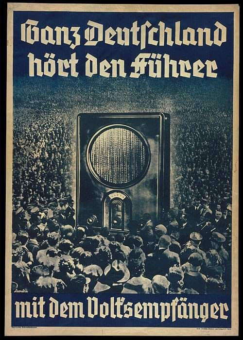{width=40%} 

# Literature and Theory

## Media effects - maximal or minimal? {.allowframebreaks}

Maximal paradigm also follows from classic work:

- attitude instability [@Converse1962; @Zaller1992]
- agenda-setting [@McCombs1972]
- framing [@Nelson1997]

\framebreak

Minimal effects assumption with increasing media diversity [@Bennett2008]:

- media environment more polarised and more diverse,
- viewers more likely to reject news conflicting with their views,
- viewers can opt for other sources.

$\rightarrow$ strong effects unlikely

## Empirical evidence {.allowframebreaks}

### Evidence for large effects

- Framing effects found in experimental data [@Busby2019; @Leeper2020].
- Newspaper slant affects attitudes [@Foos2020].
- Salience and tonality of migration news affects attitudes [@Boomgaarden2009].

### Evidence for no/weak effects

- Newspaper slant has no effect on attitudes [@Gentzkow2011; @Guess2021; @Stetka2020].
- Newspaper takeovers have no effect on attitudes [@Durante2012; @Spirig2020].

## Synthesis

**When** can we expect strong media effects?

- Many current approaches test media effects of different outlets [@Gentzkow2011; @Guess2021].
- However, \alert{news consumers discount bias and take cues from outlets}.
  + @Baum2008 show that consumers take heuristics about content bias from outlet brands.
  + @Chiang2011a show that outlet bias moderates the effect of candidate endorsements.

$\rightarrow$ \alert{within-outlet changes} in content most likely cases to observe media effects.

## Emphasis framing {.allowframebreaks}

**What kind of changes should matter?**

- I draw on literature on 
  + the \alert{value-expectancy} framework [@Ajzen2000].
  + and \alert{emphasis framing} [@Leeper2020; @Nelson1997].
- Argues that issue attitudes are a product of \alert{associated considerations}.

<!-- \framebreak -->

<!-- - For example, migration could be associated with  -->
<!--   + humanitarian crises in the mediterranean (positive frame);  -->
<!--   + crime (negative frame); -->
<!--   + cost for the welfare state (negative frame); -->
<!--   + labour market demand (positive frame). -->
<!-- - These considerations will be weighted to form an overall evaluation of the issue at hand. -->

\framebreak

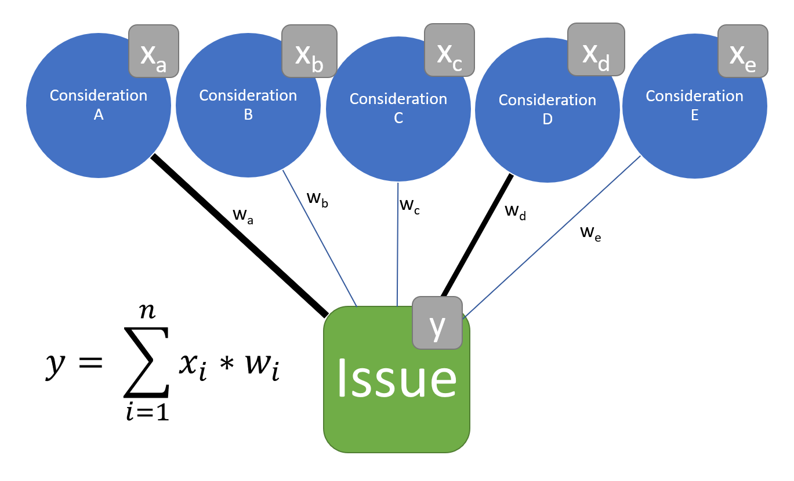

# Empirical strategy

## The case: Germany 2017

- First election after 2015 refugee movements.
- Radical-right challenger party enters parliament, center loses.
- Migration top of the agenda.

$\rightarrow$ constantly strong attention to migration, 

$\rightarrow$ good case to study effects of framing.

## Design

- Collect 2.5M articles from major German newspapers.
- Classify according to migration content.
- Identify emphasis frames.
- Correlate changes in framing with changes in attitudes.

## Issue attitudes and news consumption {.allowframebreaks}

- Panel data from the German Longitudinal Election Study [@GLES2019LongTermTracking].
- Contains questions on news consumption and immigration and integration attitudes.
- 6 waves in 2017, containing both items.
- Immigration attitude measured on a 7-point Likert scale:
  + "*Immigration should be made easier (-3) or restricted (3)*".

## Migration content {.allowframebreaks}

- Pre-assign likelihoods for migration content using extended migration dictionary.
- Draw stratified sample of 1,800 articles, hand-code.
- Fine-tune German BERT deep-learning classifier.
- Performs very well: F1: 0.94, recall: 0.93, precision: 0.95.
- 13.5k out of 400k articles in 2017 about migration (3.5\%)

\framebreak

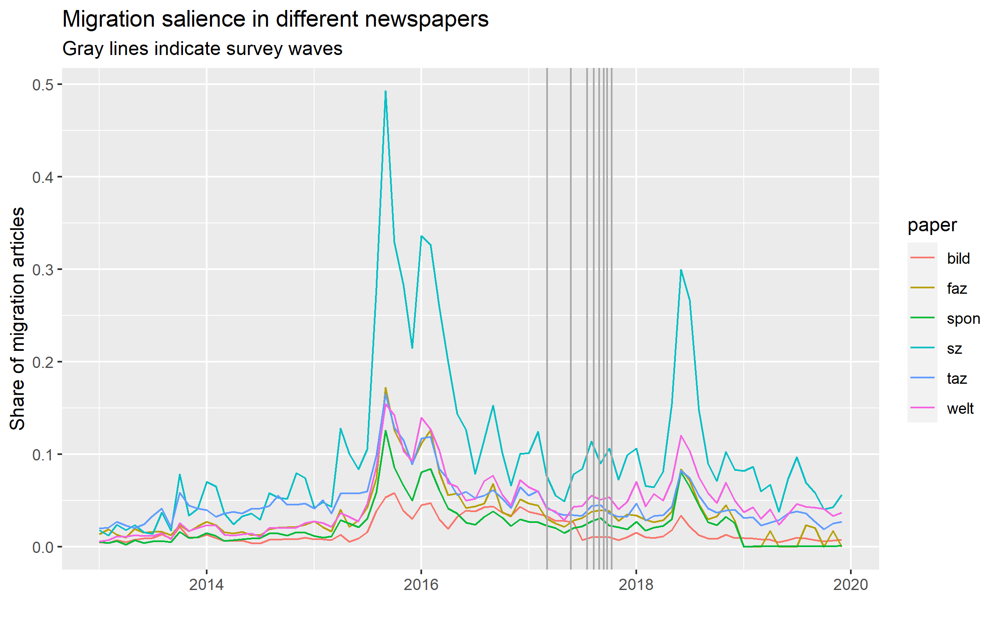

## Migration framing {.allowframebreaks}

- Estimate 60-topic structural topic model [@Roberts2014], using date and paper as covariates.
- Annotate.
- Select relevant frames with clear expectations regarding attitudinal effects.

\framebreak

\alert{Topics}:

- Capital crime (sexual assault/rape/murder) committed by refugees,
- illegal entry and petty crime,
- refugee numbers,
- labour market needs for and job market integration of refugees,
- deportations,
- internment camps (e.g. Moria),
- drownings in the Mediterranean.

\framebreak

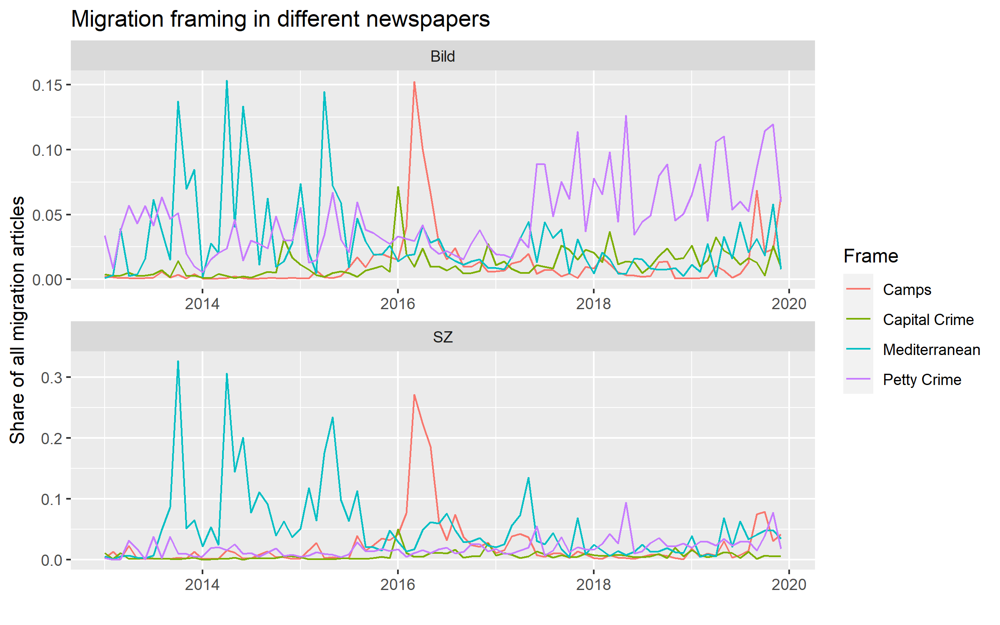

## Estimation

*Two models*:

- OLS of aggregate Difference-in-Differences (DiDs).
- Individual-level model with 2-way fixed effects.

## DiD-model {.allowframebreaks}

$$y = \beta_1*W + \beta_2*R + \beta_3*W*R$$

\centering

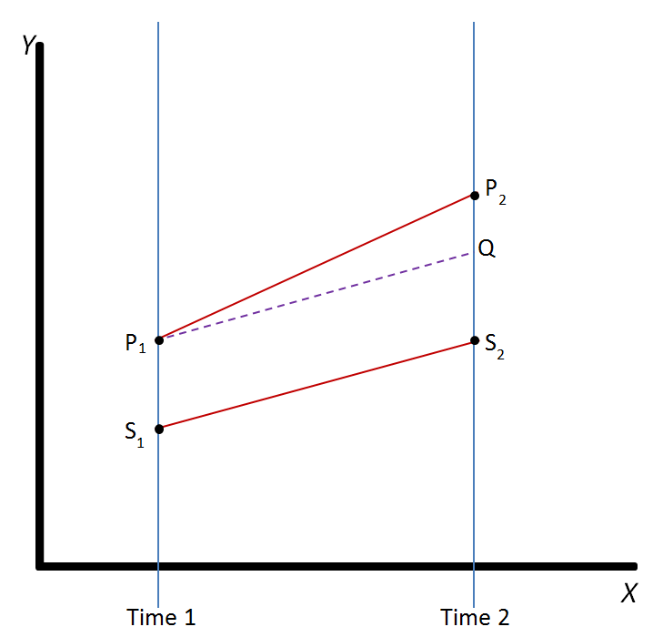{width=50%}

\framebreak

- Estimate change in newspaper framing and attitudes among readers from one wave to another, controlling for shifts in other newspapers/reader groups.
- Regress opinion shift among readership on shift in newspaper attention to different frames.
- Better identified (exact change *beyond* general trend), 
- but framing not individually matched.

## 2-way FE model {.allowframebreaks}

- Individual estimate of frame attention for each respondent, according to newspaper read.
- Regress opinion on exposure to each frame, 
- controlling for wave and individual fixed-effects.

\framebreak

- Individual estimates,
- but explains *all* variation beyond 
  + time-independent individual factors and 
  + general trends across time,
  + including random individual deviations.

# Preliminary results

Different specifications:

- all readers/exclusive readers of one newspaper,
- different lags to measure exposure (1 day, 1 week, 1 month, half a year),
- immigration and integration attitude as dependent variable.

## Difference-in-Difference model {.allowframebreaks}

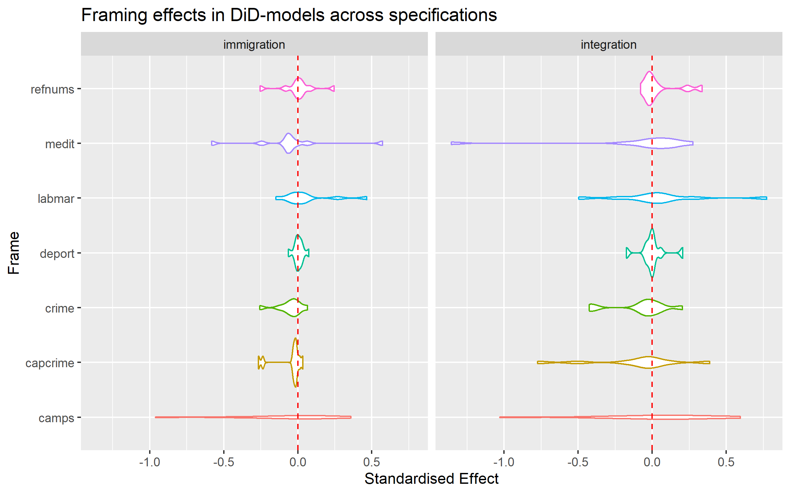

## Fixed-effect model

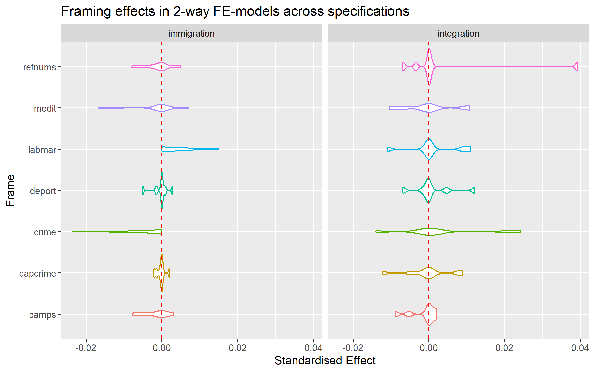

## Preliminary conclusion

- No effects of media framing even in most-likely case.
- *However*, many possible explanations:
  + Measurement issues,
  + Issue-sorting in 2015, subsequent "digging in",
  + too little variation in dependent.
  
$\rightarrow$ further work necessary...

## Further hypotheses

- Motivated reasoning and polarisation [@Taber2006].
- Readers respond by changing outlet [@Arceneaux2013].
- Mobilisation, not attitudinal change [@Gentzkow2011; @Stetka2020].

## To-do's up next

- Clump frames together for holistic picture.
- Estimate effect on readership, attitude polarisation, and AfD-support.
- Natural experiment (again)?

## Fin

\centering

*Thank you!*

# Appendix

## Variation dependent variable {.allowframebreaks}

\centering

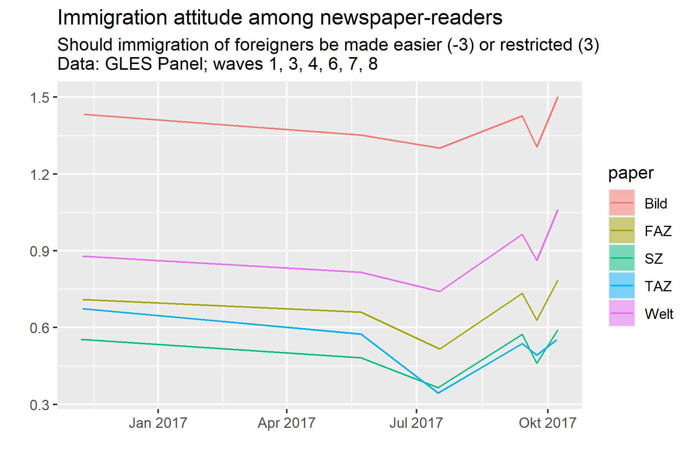

\framebreak

\centering

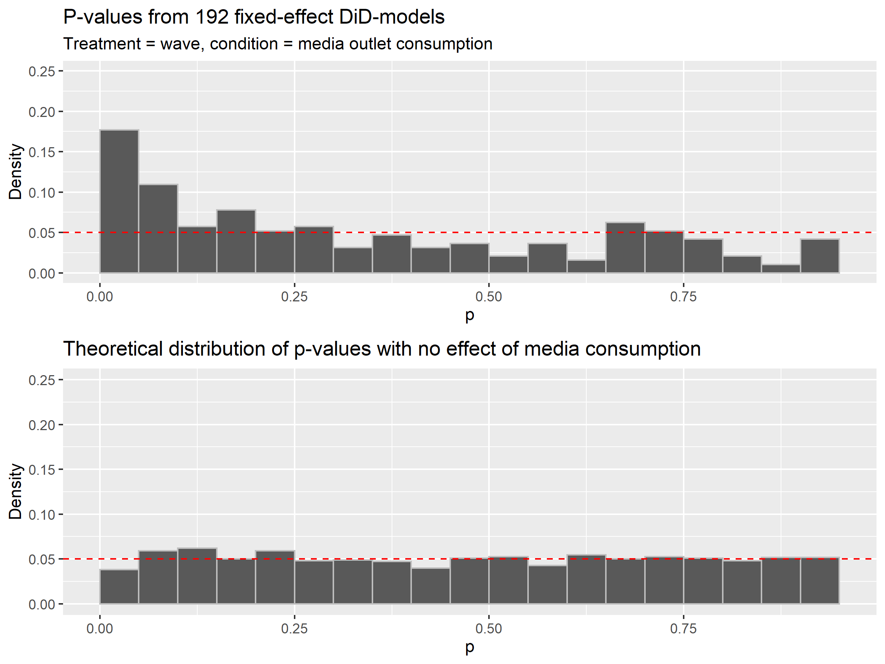

## Salience {.allowframebreaks}

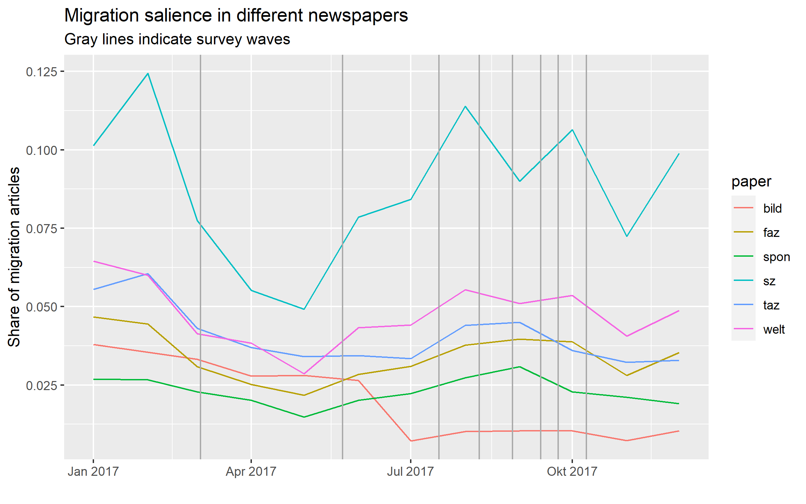

## Framing attention {.allowframebreaks}

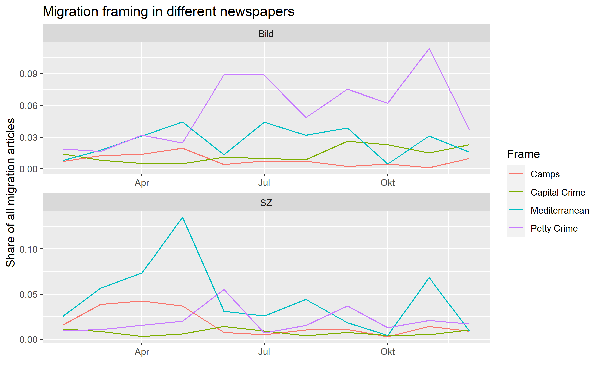

## Specifications DiD

\centering

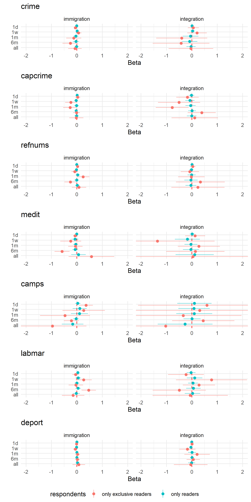{width=70%}

## Specifications 2-way FE

\centering

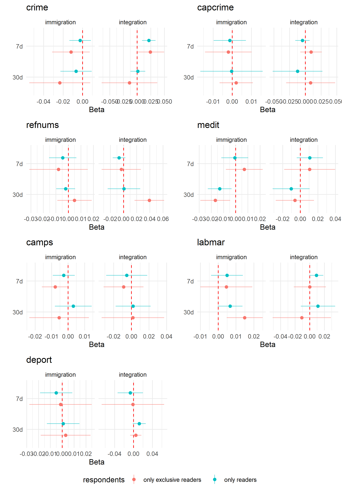{width=70%}

# Resources

## Resources {.allowframebreaks}
