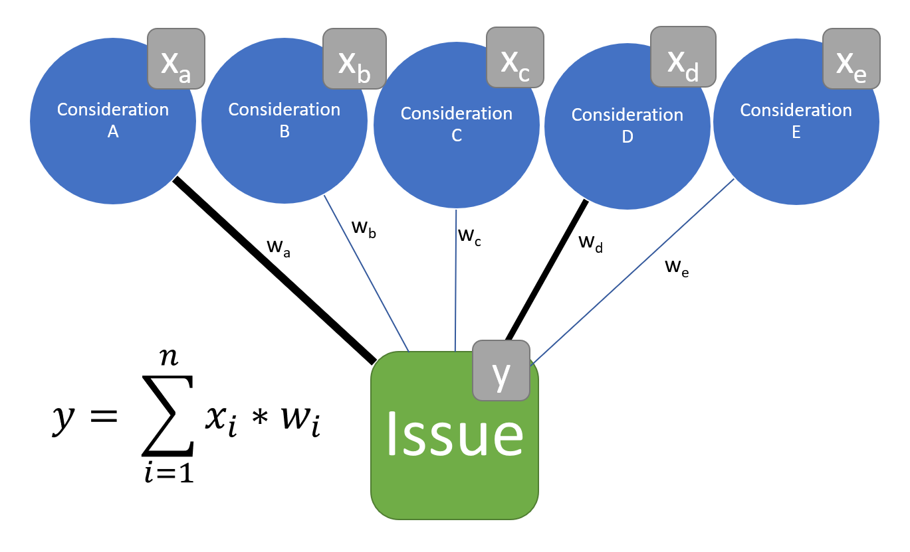

```{r xaringan-themer, include=FALSE, warning=FALSE}
library(xaringanthemer)
style_mono_accent(
  base_color = "#03396d", background_color = "#bfbfbf",
  base_font_size = "32px",
  header_h1_font_size = "1.5rem",
  header_h2_font_size = "1.25rem",
  header_h3_font_size = "1.1rem",
  header_font_google = google_font("Montserrat", 'Thin 100'),
  text_font_google   = google_font("Montserrat", "300", "300i"),
  code_font_google   = google_font("Fira Mono"),
  footnote_font_size = "0.75rem"
)


```

```{r setup, include=FALSE}

knitr::opts_chunk$set(echo = FALSE, message = F, warning = F, cache = T, out.width="80%", fig.height=4, fig.width=10, fig.align='center', eval = T, dev = "svg")
# knitr::opts_knit$set(root.dir = 'C:/Users/nicol/Dropbox/PhD/Papers/Bild/github/bild')

library(tidyverse)
library(dplyr)
library(data.table)
library(fixest)
library(lubridate)
library(patchwork)

```


class: inverse, center, middle


<!-- # Issue Definitions and Public Opinion -->

## Migration, Crime and the Heterogenous Impact of Emphasis Framing


#### Nicolai Berk<sup>*</sup>

Presentation prepared for the Political Behaviour and Institutions section at the University of Aarhus

`r Sys.Date()`


.left[.footnote[<sup>*</sup> Dynamics RTG & Humboldt Universität Berlin]]


<!-- --- -->


<!-- class: center, middle -->

<!-- #### *"The only feeling that anyone can have about an event he does not experience is the feeling aroused by his __mental image__ of that event." - W. Lippmann (1922, 3)* -->

---

## Migration coverage can look like this


---

## ...or like this


---

## Does News Content Affect Political Attitudes?

.center[

<br></br>

### "media campaigns on emerging issues can have large, lasting, and ultimately consequential effects" (Foos and Bischof 2021)


### "it is difficult for people to be persuaded by competing media accounts" (Guess et al 2021)

]

<!-- #### Yes, says Foos and Bischof, BUT: -->
<!-- - very __long-term__ study -->
<!--   - __pre-internet__ (Bennett & Iyengar) -->
<!--   - likely __socialisation__ effect -->
<!-- - __unclear treatment__ (anti-Sun identity?) -->
<!-- - does not speak to content changes __within__ newspapers -->

---

## Does News Content Affect Political Attitudes?

### What can explain this discrepancy?

- existing observational studies often use **structural, long-term changes** in media markets (Durante & Knight, Foos & Bischof, Grossman et al).
- Unclear what the **everyday, short-term** impact of changing news content is.
- Recent studies assessing short-term changes usually present **null-effects** (Spirig, Guess et al).


---

# Argument

1. By __changing the emphasis__ of different considerations about political issues, news outlets can **reshape** their consumers' **attitudes**.
  + in the short term
  + in contemporary news environments
2. The minimal effects literature has been ignoring the **importance of predispositions**.
  + __Selective exposure__ takes place, but doesn't mitigate framing effects.

---

# Theoretical Model

.left-column[


]

.right-column[

- building on **emphasis framing** literature (Leeper & Slothuus, Nelson et al)
- cognitive association with a consideration is a function of emphasis of this aspect in media content
- conditioned by 
  + **pre-disposition** (Zaller)
  + **pre-treatment** (Slothuus 2016)

]

---

# Emphasis Framing

```{r out.width="70%"}



```


---

class: center, middle, inverse

# The Case

---

# Bild's migration coverage following 2015

.left-column[


]

.right-column[

- Migration is __the__ big topic preceding the 2017 _Bundestag_ election in Germany.
- Bild editor-in-chief Kai Diekmann left in February 2017, with Reichelt taking over.
- Reichelt increasingly **framed migrants as criminals** (Niggemeier 2018).
- **Least likely case**: 
  + pre-treatment, 
  + issue sorting, 
  + salient party cues, 
  + emotional issue.

]


---

# Bild's migration coverage following 2015 II

.left-column[


]

.right-column[


Interesting because:

- **clearly identifiable short-term-change** in migration coverage.
- clear expectations regarding impact.
- Changing editor was not debated in the media $\rightarrow$ __No co-treatment__! (see Spirig)


]


---

class: center, middle, inverse

# Study Design

---


# Study Design

#### Combine panel data with media content analysis in Germany surrounding the 2017 election

- Study 1: Exploit change in migration framing due to **editorial change**
  + DiD design pre-post editorial change
  + newspaper consumption conditions treatment
- Study 2: correlate opinion change with **individual exposure**
  + generate estimates of individual frame exposure
  + based on reported newspaper consumption and interview date
  + robustness, but also extension beyond tabloid readers


---

## Measurement: Emphasis Framing in Print Media

#### Independent Variable (following Nicholson & Culpepper)
- Collected 2.5M news articles from major German dailies
- Two-step identification of issue definitions:
  1. Supervised deep-learning model (BERT) to **identify migration content**
  2. Structural Topic Model to **measure attention to issue considerations**

---

## Identify migration content

- Annotate 1800 articles to identify their migration content.
- Fine-tune German BERT deep-learning classifier.
- accuracy: 95.5% (F1: 0.94, recall: 0.93, precision: 0.95)
- 13.5k out of 400k articles in 2017 about migration (3.5\%)

---

## Measure migration frames

- Estimate 60-topic structural topic model on identified migration articles (Roberts, Stewart and Tingley 2019).
- using date and paper as covariates (Nicholls & Culpepper).
- Annotate.
- Select crime-related frames.

---

# Change in Crime News post-Reichelt (treatment validity)


```{r case_crime, out.width = "90%"}


## define survey dates
gles_p_long <- 
  fread('C:/Users/nicol/Dropbox/PhD/Papers/Bild/github/bild/data/gles/Panel/long_cleaned.csv')

survey_dates <- 
  gles_p_long %>% 
  filter(!is.na(date_clean)) %>% 
  filter(!is.na('1130_clean') & !is.na('1661a_clean')) %>%  
  filter(date_clean < as.Date("2018-01-01")) %>% 
  group_by(wave) %>% 
  summarise(date = max(date_clean)) %>% 
  ungroup() %>% 
  select(date)

rm(gles_p_long)

## load & transform data frame attention
load("C:/Users/nicol/Dropbox/PhD/Papers/Bild/github/bild/data/media_daily_2022-02-02.Rdata")

merged_media <- 
  merged_media %>% 
  mutate(paper = recode(paper, 
                        'bild' = 'Bild', 'faz' = 'FAZ', 'spon' = 'Spiegel',
                        'sz' = 'SZ', 'taz' = 'TAZ', 'welt' = 'Welt'),
         post = date_new > as.Date("2017-02-01"),
         date_month = floor_date(as.Date(date_new), 'month'))

## visualise
trendplot <- 
  merged_media %>% 
  filter(date_new < as.Date("2018-01-01"), date_new >= as.Date("2016-01-01")) %>% 
  mutate(
    date_month = floor_date(as.Date(date_new), 'month')
  ) %>%
  group_by(paper != "Bild", date_month) %>%
  summarise(across(share_mig:hungary_referendum_share, mean, na.rm = T),
            across(n_mig_sal:n_tot, sum, na.rm = T)) %>%
  mutate(crime_share = crime_schlepp_share + sexual_assault_share,
         post = date_month >= as.Date("2017-02-01")) %>% 
  filter(date_month < as.Date("2020-01-01")) %>% 
  ggplot(aes(x = date_month, y = crime_share, col = `paper != "Bild"`)) +
  geom_line() +
  geom_rug(data = survey_dates, aes(x = date),sides = 't', inherit.aes = F) +
  # geom_point() +
  # geom_smooth(alpha = 0.1) +
  geom_vline(xintercept = as.Date("2017-02-01"), lty = 2, col = "red") +
  ggtitle("Monthly Share of Migration Content Devoted to Crime Frames", "Bild vs. other major daily newspapers, 2016-2017") + 
  xlab("Date") + ylab("Share of Migration Content") +
  # facet_wrap(~paper)
  theme_minimal() +
  theme(legend.position = "none")


# DiD with placebo papers, 2016-17
merged_media <- 
  merged_media %>% 
  filter(date_new < as.Date("2018-01-01"),
         date_new >= "2016-01-01")


treatment_ests <- 
  data.frame()

merged_media$dv    <-  merged_media[["crime_schlepp_share"]] + merged_media[["sexual_assault_share"]] + merged_media[["bild_footer_share"]]
merged_media$post  <-  merged_media$date_new >= as.Date("2017-02-01")

for (p in unique(merged_media$paper)){
  
  merged_media$treatment <-  merged_media$paper == p
  
  did_model <- lm(dv ~ post*treatment, data = merged_media)
  
  est <- did_model$coefficients["postTRUE:treatmentTRUE"][[1]]
  lower <- confint(did_model)["postTRUE:treatmentTRUE", 1]
  upper <- confint(did_model)["postTRUE:treatmentTRUE", 2]
  
  treatment_ests <- 
    rbind(treatment_ests,
          data.frame(
            model = "DiD",
            paper = p,
            est   = est,
            lower = lower,
            upper = upper
          ))
}

## vis
treatment_ests$paper <- 
  factor(treatment_ests$paper,
          levels = treatment_ests %>%
                    filter(model == "DiD") %>% 
                    arrange(est) %>% 
                    select(paper) %>%
                    unlist()
    )


placebo_papers <- 
  treatment_ests %>% 
  ggplot(aes(x = est, xmin = lower, xmax = upper, 
             y = paper, col = paper != "Bild")) +
  geom_pointrange() +
  geom_vline(xintercept = 0,
             col = "red", lty = 2) +
  theme_minimal() +
  xlab("Estimated DiD") + ylab("") +
  # ggtitle("Papers' Change in Crime Framing (DiD), 2016-2017") +
  theme(legend.position = "None") +
  coord_flip()


trendplot + placebo_papers

# rm(merged_media)

```

---

## Measurement: Immigration Attitude

#### Dependent Variable
- German Longitudinal Election Study (GLES) Panel
- 7-point Likert-scale asking whether immigration to Germany should be 
  + made easier (-3) or
  + restricted (3).
  

---

## Measurement: News Consumption
  
#### Conditioning Variable
- Question on print media consumed last week
- Match estimates for media content with interview date
- Calculate share of migration content devoted to crime
- Weighted by days read past week


---

class: center, middle, inverse

# Results


---

# DiD

$y_{it} = \alpha + \beta_1*Post_t + \beta_2 * Treatment_i + \beta_3 * Post_t * Treatment_i + \epsilon_{gt}$

```{r did-ests}
gles_p_long <- fread('C:/Users/nicol/Dropbox/PhD/Papers/Bild/github/bild/data/gles/Panel/long_cleaned.csv')

gles_p_long$dv <- gles_p_long$`1130_clean`
gles_p_long$treat <- gles_p_long$`1661a_bin`
gles_p_long$post <- gles_p_long$date_clean>= as.Date("2017-02-01")
gles_p_long <- 
  gles_p_long %>% 
  select(lfdn, date_clean, `1130_clean`) %>% 
  filter(!is.na(`1130_clean`)) %>% 
  arrange(lfdn, date_clean) %>% 
  group_by(lfdn) %>% 
  slice(1) %>% 
  mutate(init_mig = `1130_clean`) %>% 
  select(lfdn, init_mig) %>% 
  right_join(gles_p_long, by = "lfdn")

gles_p_long <- 
  gles_p_long %>% 
  mutate(mip_mig_crime_lag = lag(mip_mig_crime)) %>% 
  filter(!is.na(mip_mig_crime)) %>% 
  arrange(lfdn, date_clean) %>% 
  group_by(lfdn) %>% 
  slice(1) %>% 
  mutate(mip_mig_crime_init = mip_mig_crime) %>% 
  select(lfdn, mip_mig_crime_init) %>% 
  right_join(gles_p_long, by = "lfdn")

gles_p_long_1617 <- 
  gles_p_long %>% 
        filter(date_clean >= as.Date("2016-01-01"),
               date_clean <  as.Date("2018-01-01"))
rm(gles_p_long)

# model 1: direct effect
ate <- 
  feglm(dv ~ post * treat | lfdn, 
      cluster = c("lfdn"), 
      data = gles_p_long_1617)

inter <- 
  feglm(dv ~ post * treat * init_mig, 
      cluster = c("lfdn"), 
      data = gles_p_long_1617)

inter_ctrl <- 
  feglm(dv ~ post * treat * init_mig + mip_mig_crime, 
      cluster = c("lfdn"), 
      data = gles_p_long_1617)

points <- ate$coefficients
ests <- cbind(points, confint(ate))
ests %>% 
  # mutate(name = factor(row.names(.), levels = row.names(.))) %>% 
  ggplot(aes(y = row.names(.), x = points, xmin = `2.5 %`, xmax = `97.5 %`)) +
  geom_pointrange() +
  geom_vline(xintercept = 0, col = "red", lty = 2) +
  ylab("") + xlab("Estimate") +
  scale_y_discrete(limits=rev(row.names(ests)),
                   labels = rev(c("Post", "Treatment", "Post X Treatment")))

```

---

# Conditioning on initial migration opinion

$y_{it} = \beta_1 * Post_t *  Treatment_i * y_{i,t=1} + \epsilon_{gt}$

```{r did_inter}

points <- inter$coefficients
ests <- cbind(points, confint(inter))

plot_did_inter <- 
  ests %>% 
  filter(row.names(.) %in% c("postTRUE:treatTRUE", "postTRUE:treatTRUE:init_mig")) %>% 
  mutate(name = fct_reorder(row.names(.), desc(row.names(.)))) %>% 
  ggplot(aes(y = name, x = points, xmin = `2.5 %`, xmax = `97.5 %`)) +
  geom_pointrange() +
  geom_vline(xintercept = 0, col = "red", lty = 2) +
  ylab("") + xlab("Estimate") +
  ggtitle("DiD-estimate with interaction") +
  xlim(-0.1, 0.4) + 
  scale_y_discrete(labels = rev(c("Post X Treatment", "Post X Treatment X Initial Opinion")))


plot_did_inter


```

(Constitutive terms omitted for brevity.)

---

# 1000 Bootstraps

```{r, out.width= "90%"}


gles_p_long_1617$dv <- gles_p_long_1617$`1130_clean`
gles_p_long_1617$treat <- gles_p_long_1617$bild_init
gles_p_long_1617$post <- gles_p_long_1617$date_clean>= as.Date("2017-02-01")


inter <- 
  feglm(dv ~ post * treat * init_mig, 
      cluster = c("lfdn"), 
      data = gles_p_long_1617)

points <- ate$coefficients
ests <- cbind(points, confint(ate))

load('C:/Users/nicol/Dropbox/PhD/Papers/Bild/github/bild/data/did_bootstraps.RData')

direct <- coef(inter)["postTRUE:treatTRUE"]
interact <- coef(inter)["postTRUE:treatTRUE:init_mig"]

did_bootstrap <- 
  ggplot() +
  geom_histogram(data = gles_p_long_1617 %>% filter(wave == "1"), mapping = aes(x = init_mig, after_stat(density)), alpha = 0.4, bins = 8) +
  geom_abline(data = bs_did_ests, aes(slope = IA, intercept = DiD, group = boots), alpha= 0.05) +
  geom_abline(slope = interact, intercept = direct, col = "red") +
  theme_minimal() +
  geom_hline(yintercept = 0, col = "black") +
  scale_x_continuous(limits=c(-3,3)) +
  scale_y_continuous(limits=c(0,.6)) +
  ggtitle(paste0(B, " bootstrap estimates of heterogenous treatment effect")) +
  ylab("Estimate") + xlab("Initial migration attitude")

```


---

# Or, descriptively:


```{r}

gles_p_long_1617 %>% 
  filter(!is.na(treat), !is.na(init_mig)) %>%
  group_by(treat, post, init_mig) %>% 
  summarise(
    dv_point = mean(dv, na.rm = T)
    ) %>% 
  filter(post) %>% 
  pivot_wider(
    names_from = treat,
    values_from = dv_point
  ) %>% 
  mutate(difference = `TRUE`-`FALSE`) %>% 
  ggplot(aes(x = init_mig, y = difference)) +
  geom_col(fill = 'lightblue') + 
  theme_minimal() + xlab("") + ylab("") +
  ggtitle("Pre-post differences of treated and untreated across initial migration attitude")

```

---

# Individual-level exposure model

$y_{it} = \alpha + \beta_1*CrimeExposure_{it} + \rho_i + \phi_t + \epsilon_{it}$

```{r ind_exp}

merged_data <- fread(file = "C:/Users/nicol/Dropbox/PhD/Papers/Bild/github/bild/data/merged_2022-03-05.csv")

merged_data <- 
  merged_data %>% 
  mutate(crime_share = crime_schlepp_share + sexual_assault_share,
         # imm_att = factor(imm_att, levels = c("conservative", "moderate", "liberal", "miss")),
         dv = `1130_clean`) %>% 
  filter(lag == 7)

merged_data <- 
  merged_data %>% 
  filter(!is.na(`1130_clean`)) %>% 
  group_by(lfdn) %>% 
  arrange(lfdn, date_clean.x) %>% 
  select(`1130_clean`, lfdn) %>% 
  slice(1) %>% 
  mutate(init_mig = `1130_clean`) %>%
  select(init_mig, lfdn) %>% 
  right_join(merged_data, by = "lfdn")

# add lagged crime_share and dv
merged_data <- 
  merged_data %>%
  ungroup() %>% 
  arrange(lfdn, date_clean.x) %>% 
  group_by(lfdn) %>% 
  filter(!is.na(crime_share)) %>% 
  mutate(crime_share_lag = lag(crime_share),
         dv_lag = lag(dv))

# estimation ####

# individual exposure ####

# direct crime
ind_ate <- 
  feglm(dv ~ crime_share | wave + lfdn,  # positive, p < 0.1
      cluster = c("lfdn"), data = merged_data)

# crime X initial imm_att
ind_inter <- 
  feglm(dv ~ crime_share:init_mig + crime_share | wave + lfdn,  
      cluster = c("lfdn"), data = merged_data)


ind_inter_ctrl <- 
  feglm(dv ~ crime_share:init_mig + crime_share + mip_mig_crime | wave + lfdn,  
      cluster = c("lfdn"), data = merged_data)


points <- ind_ate$coefficients
ests <- cbind(points, confint(ind_ate))
plot_ind_ate <- 
  ests %>% 
  # mutate(name = factor(row.names(.), levels = row.names(.))) %>% 
  ggplot(aes(y = row.names(.), x = points, xmin = `2.5 %`, xmax = `97.5 %`)) +
  geom_pointrange() +
  geom_vline(xintercept = 0, col = "red", lty = 2) +
  ylab("") + xlab("") +
  scale_y_discrete(limits=rev(row.names(ests)),
                   labels = rev(c("Crime Exposure"))) +
  xlim(-0.75, 2)

points <- ind_inter$coefficients
ests <- cbind(points, confint(ind_inter))
plot_ind_inter <- 
  ests %>% 
  # mutate(name = factor(row.names(.), levels = row.names(.))) %>% 
  ggplot(aes(y = row.names(.), x = points, xmin = `2.5 %`, xmax = `97.5 %`)) +
  geom_pointrange() +
  geom_vline(xintercept = 0, col = "red", lty = 2) +
  ylab("") + xlab("") +
  scale_y_discrete(limits=rev(row.names(ests)),
                   labels = rev(c("Crime Exposure", "Crime Exposure X Initial Opinion"))) +
  xlim(-0.75, 2)
  
plot_ind_ate/plot_ind_inter

```


---

# Summary

- ATE is null, even slightly negative, when not controlling for prior attitude
- Conservatives do not react to increased crime framing
- Is this a ceiling effect? No, because
  - results hold when comparing among conservative outlets
  - Conservatives react to other frames (ISIS, cues by party elites)

### Is lack of conservative response a result of pre-treatment?


---

## Can this be explained by pre-treatment effects?

$y_{it} = \alpha + \beta_1*CrimeExposure_{it} + \beta_2*CrimeExposure_{it}*y_{i,t=1} + \rho_i + \phi_t + \epsilon_{it}$

```{r ind_ctrl_pret}
ind_inter_pret <- 
  feglm(dv ~ crime_share:init_mig + crime_share + crime_share_lag | wave + lfdn,  
      cluster = c("lfdn"), data = merged_data)

points <- ind_inter_pret$coefficients
ests <- cbind(points, confint(ind_inter_pret))
plot_ind_int_pret <- 
  ests %>% 
  filter(row.names(.) %in% c("crime_share", "crime_share:init_mig", "crime_share_lag")) %>%
  ggplot(aes(y = row.names(.), x = points, xmin = `2.5 %`, xmax = `97.5 %`)) +
  geom_pointrange() +
  geom_vline(xintercept = 0, col = "red", lty = 2) +
  ylab("") + xlab("Estimate") + xlim(-0.75, 2) +
  scale_y_discrete(limits=rev(c("crime_share_lag", "crime_share", "crime_share:init_mig")),
                   labels = rev(c("Lagged Crime Exposure", "Crime Exposure", "Crime Exposure X Initial Opinion"))) +
  ggtitle("added control for past exposure")


plot_ind_inter/plot_ind_int_pret
```

## Yes!

---

# Conclusion
- Citizens seem to **learn from new information** - if a consideration is already available, no opinion updating takes place
- **ATE not informative** when interested in effects of media content
- important to take into account decreased susceptibility through **prior treatment**

---

# Open Questions

- Strongest point: Focus on prior opinion effect? More on selective exposure/pre-treatment? 
- **Framing**: ComSci, Framing, Media Effects, ...?
- **additional analyses**
- Can I use **variation/cutoff in pre-treatment** to make stronger argument about moderation?

---

## Pre-treatment DiD?

```{r}


dv_diff_plot <- 
  gles_p_long_1617 %>%
  filter(!is.na(treat), !is.na(dv)) %>% 
  filter(init_mig < 0) %>% 
  group_by(treat, wave) %>% 
  select(dv, date_clean) %>% 
  summarise_all(mean, na.rm = T) %>%  
  pivot_wider(names_from = treat, values_from = dv) %>%
  mutate(difference = `TRUE` - `FALSE`) %>% 
  ggplot(aes(x = date_clean, y = difference)) + 
  geom_line() +
  theme_minimal() + xlab("") + ylab("") +
  ggtitle("Difference between treated and untreated liberals")

iv_plot <- 
  merged_media %>% 
  filter(paper == "Bild", date_new >= as.Date("2016-10-01"), date_new <= as.Date("2017-10-01")) %>% 
  mutate(date_new = floor_date(date_new, "month")) %>%
  group_by(date_new) %>%
  summarise_all(mean, na.rm = T) %>%
  mutate(crime_share = crime_schlepp_share + sexual_assault_share,
         crime_share_lag = lag(crime_share)) %>% 
  ggplot(aes(date_new)) +
  geom_col(aes(y = crime_share), width = 10) +
  theme_minimal() + xlab("") + ylab("") +
  ggtitle("Attention to Crime in Bild Migration Content")
  

dv_diff_plot/iv_plot
  
```


---

class: center, middle, inverse

# Thank you!


---

class: center, middle, inverse

# Appendix

---

class: inverse, center, middle

## Variables

---

## Individual Crime Exposure

```{r}

merged_data %>% 
  ggplot(aes(crime_share)) +
  geom_histogram() +
  xlab("Share of migration content consumed concerning crime")

```

---

# Dependent Variable

```{r}

gles_p_long_1617 %>% 
  filter(!is.na(`1130_clean`), !
           readership %in% c("", "Other", "None", "FR")) %>% 
  group_by(wave, readership) %>% 
  summarise(dv = mean(`1130_clean`, na.rm = T),
            date_min = min(date_clean)) %>% 
  ggplot(aes(x = date_min, y = dv, col = readership)) +
  geom_line()

```


---

## Correlation of past and present exposure to crime content is `r cor(merged_data$crime_share_lag, merged_data$crime_share, use = "complete.obs")`

```{r}

plot(merged_data$crime_share_lag, merged_data$crime_share)

```

---

class: inverse, center, middle


# Placebo Issues

---

## Effects on climate and socio-economic self-placement

```{r}

ests <- data.frame()

for(placebo_name in c("1090_clean", "1290_clean")){
  
  merged_data$placebo <- merged_data[[placebo_name]]
  
  ind_placebo <- 
    feglm(placebo ~ crime_share * crime_share_lag | wave,  
        cluster = c("lfdn"), data = merged_data)
  
  points <- ind_placebo$coefficients
  
  ests <- rbind(cbind(estimate = names(points), 
                      points, 
                      confint(ind_placebo), 
                      placebo = rep(placebo_name, 3)), 
                ests)
  
}


plot_ind_pretint <- 
  ests %>% 
  ggplot(aes(y = estimate, x = points, xmin = `2.5 %`, xmax = `97.5 %`)) +
  geom_pointrange() +
  geom_vline(xintercept = 0, col = "red", lty = 2) +
  ylab("") + xlab("Estimate") +
  ggtitle("Interaction with past exposure") +
  facet_grid(placebo~1) +
  scale_y_discrete(limits=rev(c("crime_share_lag", "crime_share", "crime_share:crime_share_lag")))


plot_ind_pretint


```

---

class: inverse, center, middle

# Mediated by pre-existing issue definitions?

---

## Control for mention of migrant crime as MIP in DiD:

```{r inter_ctrl}

points <- inter_ctrl$coefficients
ests <- cbind(points, confint(inter_ctrl))
plot_did_int_mip <- 
  ests %>% 
  filter(row.names(.) %in% c("postTRUE:treatTRUE", "postTRUE:treatTRUE:init_mig", "mip_mig_crimeTRUE")) %>% 
  ggplot(aes(y = row.names(.), x = points, xmin = `2.5 %`, xmax = `97.5 %`)) +
  geom_pointrange() +
  geom_vline(xintercept = 0, col = "red", lty = 2) +
  ylab("") + xlab("Estimate") +
  scale_y_discrete(limits=rev(row.names(ests)[row.names(ests) %in% c("postTRUE:treatTRUE", "postTRUE:treatTRUE:init_mig", "mip_mig_crimeTRUE")])) +
  ggtitle("added control for mention of migrant crime")+
  xlim(-0.1, 0.4)


plot_did_inter/plot_did_int_mip


```

---

# Control for MIP: Migrant Crime


```{r ind_inter_ctrl}
points <- ind_inter_ctrl$coefficients
ests <- cbind(points, confint(ind_inter_ctrl))
plot_ind_int_mip <- 
  ests %>% 
  filter(row.names(.) %in% c("crime_share", "crime_share:init_mig", "mip_mig_crimeTRUE")) %>%
  ggplot(aes(y = row.names(.), x = points, xmin = `2.5 %`, xmax = `97.5 %`)) +
  geom_pointrange() +
  geom_vline(xintercept = 0, col = "red", lty = 2) +
  ylab("") + xlab("Estimate") +
  scale_y_discrete(limits=rev(c("mip_mig_crimeTRUE", "crime_share", "crime_share:init_mig"))) +
  ggtitle("added control for mention of migrant crime")


plot_ind_inter/plot_ind_int_mip
```

### No: effect seems to be independent.


---

class: inverse, middle, center

## Effect on Issue Definitions

---


## Does increased exposure to crime affect likelihood to report criminal migrants as the main problem?


```{r ind_inter_dv}

ind_dv_mip <- 
  feglm(mip_mig_crime ~ crime_share | wave + lfdn,  
      cluster = c("lfdn"), data = merged_data)

points <- ind_dv_mip$coefficients
ests <- cbind(points, confint(ind_dv_mip))
plot_ind_dv_mip <- 
  ests %>% 
  ggplot(aes(y = row.names(.), x = points, xmin = `2.5 %`, xmax = `97.5 %`)) +
  geom_pointrange() +
  geom_vline(xintercept = 0, col = "red", lty = 2) +
  ylab("") + xlab("Estimate") +
  ggtitle("Effect of exposure on reporting migrant crime as MIP")


ind_inter_dv <- 
  feglm(mip_mig_crime ~ crime_share:init_mig + crime_share + init_mig | wave,  
      cluster = c("lfdn"), data = merged_data)

points <- ind_inter_dv$coefficients
ests <- cbind(points, confint(ind_inter_dv))
plot_ind_int_mip <- 
  ests %>% 
  filter(row.names(.) %in% c("crime_share", "crime_share:init_mig")) %>%
  ggplot(aes(y = row.names(.), x = points, xmin = `2.5 %`, xmax = `97.5 %`)) +
  geom_pointrange() +
  geom_vline(xintercept = 0, col = "red", lty = 2) +
  ylab("") + xlab("Estimate") +
  scale_y_discrete(limits=rev(c("crime_share", "crime_share:init_mig"))) +
  ggtitle("and interaction with prior attitudes")


plot_ind_dv_mip/plot_ind_int_mip
```

### Effect larger among liberals and moderates (also huge effect).

---

### What if controlling for attitude?

```{r mip_ctrl_dv}

ind_inter_dv_ctrl <- 
  feglm(mip_mig_crime ~ crime_share:init_mig + crime_share + dv | wave,  
      cluster = c("lfdn"), data = merged_data)

points <- ind_inter_dv_ctrl$coefficients
ests <- cbind(points, confint(ind_inter_dv_ctrl))
plot_ind_int_mip_ctrl <- 
  ests %>% 
  # filter(row.names(.) %in% c("crime_share", "crime_share:init_mig")) %>%
  ggplot(aes(y = row.names(.), x = points, xmin = `2.5 %`, xmax = `97.5 %`)) +
  geom_pointrange() +
  geom_vline(xintercept = 0, col = "red", lty = 2) +
  ylab("") + xlab("Estimate") +
  # scale_y_discrete(limits=rev(c("crime_share", "crime_share:init_mig"))) +
  ggtitle("additional control: dependent variable")


plot_ind_int_mip/plot_ind_int_mip_ctrl

```

### Interaction disappears. Model highly sensitive to inclusion of past and current attitude as well as individual FEs.

---


class: inverse, middle, center

# Other frames

---

## All frames conditioned on initial attitude

```{r}


est_ov <- data.frame()

for (treat in 
     merged_data %>% 
     ungroup() %>%  
     select(n_articles:hungary_referendum_share, -essener_tafel_share) %>% 
     .[,apply(., FUN = mean, na.rm = T, MARGIN = 2) > 0.02] %>% # restrict to topics making up 2% or more of imm coverage on average
     colnames()){
  merged_data$treatment <- merged_data[[eval(treat)]]
  ests <- feglm(dv ~ treatment*init_mig | wave, data = merged_data, cluster = c("lfdn"))
  
  
  data.frame(
    treatment   = treat,
    treat_est   = ests$coefficients[["treatment"]],
    treat_lower = confint(ests)["treatment",][[1]],
    treat_upper = confint(ests)["treatment",][[2]],
    ia_est   = ests$coefficients[["treatment:init_mig"]],
    ia_lower = confint(ests)["treatment:init_mig",][[1]],
    ia_upper = confint(ests)["treatment:init_mig",][[2]]
  ) %>% 
  rbind(est_ov, .) -> est_ov
  
}

est_ov %>% 
  pivot_longer(cols = treat_est:ia_upper, names_to = c("estimate", ".value"), names_pattern = "(.*)_(.*)") %>% 
  filter(estimate == "ia") %>% 
  ggplot(aes(x = est, xmin = lower, xmax = upper, y = treatment)) +
  geom_pointrange() +
  geom_vline(xintercept = 0, col = "red", lty = 2)

```

---

## All frames conditioned on pre-treatment

```{r}


est_ov_pret <- data.frame()

for (treat in 
     merged_data %>% 
     ungroup() %>%  
     select(n_articles:hungary_referendum_share, -essener_tafel_share) %>% 
     .[,apply(., FUN = mean, na.rm = T, MARGIN = 2) > 0.02] %>% # restrict to topics making up 2% or more of imm coverage on average
     colnames()){
  merged_data$treatment <- merged_data[[eval(treat)]]
  merged_data <- 
    merged_data %>% 
    arrange(lfdn, date_clean.x) %>% 
    group_by(lfdn) %>% 
    mutate(treatment_lag = lag(treatment))
  
  ests <- feglm(dv ~ treatment*treatment_lag | wave, data = merged_data, cluster = c("lfdn"))
  
  
  data.frame(
    treatment   = treat,
    treat_est   = ests$coefficients[["treatment"]],
    treat_lower = confint(ests)["treatment",][[1]],
    treat_upper = confint(ests)["treatment",][[2]],
    treat_lag_est   = ests$coefficients[["treatment_lag"]],
    treat_lag_lower = confint(ests)["treatment_lag",][[1]],
    treat_lag_upper = confint(ests)["treatment_lag",][[2]],
    ia_est   = ests$coefficients[["treatment:treatment_lag"]],
    ia_lower = confint(ests)["treatment:treatment_lag",][[1]],
    ia_upper = confint(ests)["treatment:treatment_lag",][[2]]
  ) %>% 
  rbind(est_ov_pret, .) -> est_ov_pret
  
}

est_ov_pret %>% 
  pivot_longer(cols = treat_est:ia_upper, names_to = c("estimate", ".value"), names_pattern = "(.*)_(.*)") %>% 
  filter(estimate == "ia") %>% 
  ggplot(aes(x = est, xmin = lower, xmax = upper, y = treatment)) +
  geom_pointrange() +
  geom_vline(xintercept = 0, col = "red", lty = 2)

```

---

## Camps Frame

```{r}

merged_data <- 
  merged_data %>% 
  mutate(camps_share = camps_greece_share + ME_camps_share) %>% 
  mutate(camps_share_lag = lag(camps_share))

ind_pretind <- 
  feglm(dv ~ camps_share * camps_share_lag | wave,  
      cluster = c("lfdn"), data = merged_data)

points <- ind_pretind$coefficients
ests <- cbind(points, confint(ind_pretind))
plot_ind_pretint <- 
  ests %>% 
  ggplot(aes(y = row.names(.), x = points, xmin = `2.5 %`, xmax = `97.5 %`)) +
  geom_pointrange() +
  geom_vline(xintercept = 0, col = "red", lty = 2) +
  ylab("") + xlab("Estimate") +
  ggtitle("Interaction with past exposure") +
  scale_y_discrete(limits=rev(c("camps_share_lag", "camps_share", "camps_share:camps_share_lag")))


plot_ind_pretint
```


---

## ISIS Frame

```{r}


merged_data <- 
  merged_data %>% 
  mutate(islamic_state_share_lag = lag(islamic_state_share))

ind_pretind <- 
  feglm(dv ~ islamic_state_share * islamic_state_share_lag | wave,  
      cluster = c("lfdn"), data = merged_data)

points <- ind_pretind$coefficients
ests <- cbind(points, confint(ind_pretind))
plot_ind_pretint <- 
  ests %>% 
  ggplot(aes(y = row.names(.), x = points, xmin = `2.5 %`, xmax = `97.5 %`)) +
  geom_pointrange() +
  geom_vline(xintercept = 0, col = "red", lty = 2) +
  ylab("") + xlab("Estimate") +
  ggtitle("Interaction with past exposure") +
  scale_y_discrete(limits=rev(c("islamic_state_share_lag", "islamic_state_share", "islamic_state_share:islamic_state_share_lag")))


plot_ind_pretint
```


---


## Party Cue

```{r}

merged_data <- 
  merged_data %>% 
  mutate(csu_poverty_share_lag = lag(csu_poverty_share))

ind_pretind <- 
  feglm(dv ~ csu_poverty_share * csu_poverty_share_lag | wave,  
      cluster = c("lfdn"), data = merged_data)

points <- ind_pretind$coefficients
ests <- cbind(points, confint(ind_pretind))
plot_ind_pretint <- 
  ests %>% 
  ggplot(aes(y = row.names(.), x = points, xmin = `2.5 %`, xmax = `97.5 %`)) +
  geom_pointrange() +
  geom_vline(xintercept = 0, col = "red", lty = 2) +
  ylab("") + xlab("Estimate") +
  ggtitle("Interaction with past exposure") +
  scale_y_discrete(limits=rev(c("csu_poverty_share_lag", "csu_poverty_share", "csu_poverty_share:csu_poverty_share_lag")))


plot_ind_pretint
```


---


class: center, inverse, middle

## Other

---

## Is effect of exposure dependent on past exposure?

```{r pret_ind}

ind_pretind <- 
  feglm(dv ~ crime_share * crime_share_lag | wave,  
      cluster = c("lfdn"), data = merged_data)

points <- ind_pretind$coefficients
ests <- cbind(points, confint(ind_pretind))
plot_ind_pretint <- 
  ests %>% 
  ggplot(aes(y = row.names(.), x = points, xmin = `2.5 %`, xmax = `97.5 %`)) +
  geom_pointrange() +
  geom_vline(xintercept = 0, col = "red", lty = 2) +
  ylab("") + xlab("Estimate") +
  ggtitle("Interaction with past exposure") +
  scale_y_discrete(limits=rev(c("crime_share_lag", "crime_share", "crime_share:crime_share_lag")),
                   labels = rev(c("Lagged Crime Exposure", "Crime Exposure", "Crime Exposure X Lagged Crime Exposure")))


plot_ind_pretint

```

### Yes.

(Finding is sensitive to individual fixed effects.)

---

## Agenda setting vs framing


```{r}

inter <- 
  feglm(dv ~ crime_share * n_articles | lfdn + wave, 
      cluster = c("lfdn"), 
      data = merged_data)

points <- inter$coefficients
ests <- cbind(points, confint(inter))

plot_did_inter_ag <- 
  ests %>% 
  mutate(name = fct_reorder(row.names(.), desc(row.names(.)))) %>% 
  ggplot(aes(y = name, x = points, xmin = `2.5 %`, xmax = `97.5 %`)) +
  geom_pointrange() +
  geom_vline(xintercept = 0, col = "red", lty = 2) +
  ylab("") + xlab("Estimate") +
  ggtitle("Agenda setting vs framing effects")


inter

```
(not significant)

---

## Model Bild readers vs. other conservatives

```{r}

inter <- 
  feglm(dv ~ post * treat * init_mig, 
      cluster = c("lfdn"), 
      data = gles_p_long_1617 %>% 
        filter(`1661a_bin` | `1661c_bin` | `1661f_bin`))

points <- inter$coefficients
ests <- cbind(points, confint(inter))

plot_did_inter_cons <- 
  ests %>% 
  filter(row.names(.) %in% c("postTRUE:treatTRUE", "postTRUE:treatTRUE:init_mig")) %>% 
  mutate(name = fct_reorder(row.names(.), desc(row.names(.)))) %>% 
  ggplot(aes(y = name, x = points, xmin = `2.5 %`, xmax = `97.5 %`)) +
  geom_pointrange() +
  geom_vline(xintercept = 0, col = "red", lty = 2) +
  ylab("") + xlab("Estimate") +
  ggtitle("Control: conservative readers")


plot_did_inter_cons

```


---

# Relationship of Issue Importance and Attitude

```{r}

merged_data %>% 
  filter(!is.na(`1130_clean`) & !is.na(`1140_clean`)) %>% 
  ggplot(aes(x = `1140_clean`+3, y = `1130_clean`)) +
  geom_violin(aes(x = as.factor(`1140_clean`)), fill = 'lightblue') +
  geom_smooth(method = "lm", formula = y ~ poly(x, 2))

```

