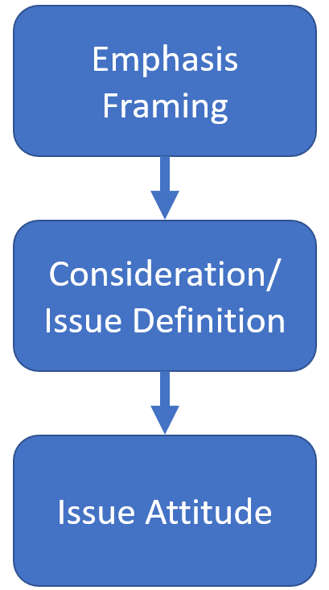

```{r xaringan-themer, include=FALSE, warning=FALSE}
library(xaringanthemer)
style_mono_accent(
  base_color = "#004A95", background_color = "#bfbfbf",
  base_font_size = "36px",
  header_h1_font_size = "1.3rem",
  header_h2_font_size = "1.2rem",
  header_h3_font_size = "1.05rem",
  header_font_google = google_font("Lato", '700'),
  text_font_google   = google_font("Lato", "400"),
  code_font_google   = google_font("Fira Mono"),
  footnote_font_size = "0.75rem"
)


```

```{r, load_refs, include=FALSE, cache=FALSE}
library(RefManageR)
BibOptions(check.entries = FALSE, 
           bib.style = "authoryear",
           cite.style = "authoryear",
           style = "markdown",
           hyperlink = FALSE,
           dashed = FALSE)
myBib <- ReadBib("C:/Users/nicol/Dropbox/Studium/BibTex/PhD.bib", check = FALSE)
```

```{r setup, include=FALSE}

knitr::opts_chunk$set(
  echo = FALSE, 
  message = F, 
  warning = F, 
  cache = T, 
  out.width="80%", 
  fig.height=9, 
  fig.width=16, 
  fig.align='center', 
  eval = T, 
  dev = "svg"
  )
# knitr::opts_knit$set(root.dir = 'C:/Users/nicol/Dropbox/PhD/Papers/Bild/github/bild')

library(tidyverse)
library(dplyr)
library(data.table)
library(fixest)
library(lubridate)
library(patchwork)

```


class: inverse, center, middle

## How the News Media Shapes Public Opinion by Defining Political Issues


#### Nicolai Berk<sup>*</sup>

Presentation prepared for the 13th European Graduate Network Conference at the European University Institute, Florence

`r Sys.Date()`


.left[.footnote[<sup>*</sup> Dynamics RTG & Humboldt Universität Berlin]]


---

## Migration coverage can look like this

```{r out.width="70%"}


```


---

## ...or like this

```{r out.width="70%"}


```


---

## Does News Content Affect Political Attitudes?

<br>

A bullet-point review: 

- Experimental research shows large framing effects `r Citep(myBib[c("kahneman2011thinking", "Leeper2020")])`.
- Unclear if externally valid `r Citep(myBib[c("Barabas2010")])`.
- Increasing reliance on **observational studies** and **field experiments**.


---

## Research Gap

<br>

Current focus on:

- **Structural, long-term changes** in media markets `r Citep(myBib[c("Foos2022", "Grossman2022")])`.
- Effects of **changing news outlets** `r Citep(myBib[c("Broockman2022", "Guess2021")])`.
- **Average** treatment effects.

---

## Research Gap II

<br>

Unclear: 

- **everyday, medium-term** impact?
- Which news **content** is effective?
- Effect dependent on individual **predispositions**?


---

## Argument

<br>

1. News media influences public opinion by __emphasising certain considerations__ over others.
3. **Predispositions** structure individual susceptibility.

---

class: center, middle, inverse

# Theoretical Framework

---

## Expectancy-Value Model `r Citep(myBib["Ajzen2000"])`

```{r out.width="70%"}

knitr::include_graphics("CognitiveStorage.png")

```


---

## Theoretical Model

.left-column[



]

.right-column[

Cognitive **association** with a consideration is a **function of emphasis** of this aspect in media content `r Citep(myBib[c("Leeper2020",  "Nelson1997")])`.

<br>

### H1: Increased **exposure to negative considerations** results in more **negative attitudes** about an issue.


]


---

## Accessibility

<br>

- Experimental research suggests **exposure to consideration mutes effect** of subsequent exposure `r Citep(myBib[c("Druckman2012")])`.
- Hence media content only affects opinions when exposed individual **learns something new**.

### H2: Individuals are less susceptible when exposed to considerations that are **already accessible** to them.


---


class: center, middle, inverse

# The Case

---

## Bild's migration coverage following 2015

.left-column[


]

.right-column[

- Migration is __the__ big topic preceding the 2017 _Bundestag_ election in Germany.
- Bild editor-in-chief Kai Diekmann left in February 2017, with Reichelt taking over.
- Reichelt increasingly **framed migrants as criminals** `r Citep(myBib[c("Niggemeier2018Bild")])`.

]


---

## Bild's migration coverage following 2015 II

.left-column[


]

.right-column[

**Least likely case**: 
- Issue sorting, 
- pre-treatment, 
- salient party cues, 
- emotional issue.

]


---
## Bild's migration coverage following 2015 III

.left-column[


]

.right-column[


Interesting because:

- **Clearly identifiable short-term-change** in migration coverage.
- Clear expectations regarding impact.
- Changing editor was not debated in the media $\rightarrow$ __No co-treatment__! `r Citep(myBib["Spirig2020"])`.


]


---

class: center, middle, inverse

# Study Design


---

## Measurement: Emphasis Framing in Print Media

<br>

#### Independent Variable `r Citep(myBib["Nicholson2020"], before = "partly following ")`

- Collected 2.5M news articles from major German daily newspapers.
- Two-step identification of issue definitions:
  1. Supervised deep-learning model (BERT) to **select migration content**
  2. Structural Topic Model to **identify considerations**

---

## Change in Crime News post-Reichelt


```{r case_crime}


## define survey dates
gles_p_long <- 
  fread('C:/Users/nicol/Dropbox/PhD/Papers/Bild/github/bild/data/gles/Panel/long_cleaned.csv')

survey_dates <- 
  gles_p_long %>% 
  filter(!is.na(date_clean)) %>% 
  filter(!is.na('1130_clean') & !is.na('1661a_clean')) %>%  
  filter(date_clean < as.Date("2018-01-01")) %>% 
  group_by(wave) %>% 
  summarise(date = max(date_clean)) %>% 
  ungroup() %>% 
  select(date)

rm(gles_p_long)

## load & transform data frame attention
load("C:/Users/nicol/Dropbox/PhD/Papers/Bild/github/bild/data/media_daily_2022-02-02.Rdata")

merged_media <- 
  merged_media %>% 
  mutate(paper = recode(paper, 
                        'bild' = 'Bild', 'faz' = 'FAZ', 'spon' = 'Spiegel',
                        'sz' = 'SZ', 'taz' = 'TAZ', 'welt' = 'Welt'),
         post = date_new > as.Date("2017-02-01"),
         date_month = floor_date(as.Date(date_new), 'month'))

## visualise
trendplot <- 
  merged_media %>% 
  filter(date_new < as.Date("2018-01-01"), date_new >= as.Date("2016-01-01")) %>% 
  mutate(
    date_month = floor_date(as.Date(date_new), 'month')
  ) %>%
  group_by(paper != "Bild", date_month) %>%
  summarise(across(share_mig:hungary_referendum_share, mean, na.rm = T),
            across(n_mig_sal:n_tot, sum, na.rm = T)) %>%
  mutate(crime_share = crime_schlepp_share + sexual_assault_share,
         post = date_month >= as.Date("2017-02-01")) %>% 
  filter(date_month < as.Date("2020-01-01")) %>% 
  ggplot(aes(x = date_month, y = crime_share, col = `paper != "Bild"`)) +
  geom_line(size = 2) +
  geom_rug(data = survey_dates, aes(x = date),sides = 't', inherit.aes = F, size = 2) +
  # geom_point() +
  # geom_smooth(alpha = 0.1) +
  geom_vline(xintercept = as.Date("2017-02-01"), lty = 2, col = "red", size = 2) +
  # ggtitle("Monthly Share of Migration Content Devoted to Crime Frames", "Bild vs. other major daily newspapers, 2016-2017") + 
  xlab("") + ylab("Share of Migration Content") +
  # facet_wrap(~paper)
  # theme(legend.position = "none") +
  theme_xaringan() + 
  scale_color_discrete(name = "Bild reader", labels = c("Yes", "No"))


# DiD with placebo papers, 2016-17
merged_media <- 
  merged_media %>% 
  filter(date_new < as.Date("2018-01-01"),
         date_new >= "2016-01-01")


treatment_ests <- 
  data.frame()

merged_media$dv    <-  merged_media[["crime_schlepp_share"]] + merged_media[["sexual_assault_share"]] + merged_media[["bild_footer_share"]]
merged_media$post  <-  merged_media$date_new >= as.Date("2017-02-01")

for (p in unique(merged_media$paper)){
  
  merged_media$treatment <-  merged_media$paper == p
  
  did_model <- lm(dv ~ post*treatment, data = merged_media)
  
  est <- did_model$coefficients["postTRUE:treatmentTRUE"][[1]]
  lower <- confint(did_model)["postTRUE:treatmentTRUE", 1]
  upper <- confint(did_model)["postTRUE:treatmentTRUE", 2]
  
  treatment_ests <- 
    rbind(treatment_ests,
          data.frame(
            model = "DiD",
            paper = p,
            est   = est,
            lower = lower,
            upper = upper
          ))
}

## vis
treatment_ests$paper <- 
  factor(treatment_ests$paper,
          levels = treatment_ests %>%
                    filter(model == "DiD") %>% 
                    arrange(est) %>% 
                    select(paper) %>%
                    unlist()
    )


placebo_papers <- 
  treatment_ests %>% 
  ggplot(aes(x = est, xmin = lower, xmax = upper, 
             y = paper, col = paper != "Bild")) +
  geom_pointrange(size = 2) +
  geom_vline(xintercept = 0,
             col = "red", lty = 2, size = 2) +
  xlab("Estimated DiD") + ylab("") +
  # ggtitle("Papers' Change in Crime Framing (DiD), 2016-2017") +
  theme(legend.position = "None") +
  coord_flip() + theme_xaringan()


trendplot

# rm(merged_media)

```

---

## Placebo papers

```{r}

placebo_papers

```


---

## Measurement: Immigration Attitude

<br>

#### Dependent Variable

- German Longitudinal Election Study (GLES) Panel
- 7-point Likert-scale asking whether immigration to Germany should be 
  + made easier (-3) or
  + restricted (3).

---

## Measurement: News Consumption

<br>  

#### Conditioning Variable

- Question on newspapers consumed last week.
- Simple binary variable for DiD-model.
- Calculate share of migration content devoted to crime for FE model.

---

## Measurement: Accessibility

<br>
  
#### Moderator

- **Initial migration opinion** reflects product of weighted considerations.
- Those with **liberal migration attitudes** are **less likely to hold crime considerations**.


---

# Estimation

**Difference-in-Differences (DiD)**

- Comparing Bild readers and non-readers,
- before and after Reichelt takeover.
- Interaction with initial report of migrant crime as most important problem.

$$y_{it} = \alpha + \beta * Post_t *  Treatment_i * y_{i,t=1} + \epsilon_{gt}$$

.footnote[(Constitutive terms omitted for brevity.)]

---

# Estimation II

<br>

**Fixed-effects-model**
- Generate estimates of **individual exposure** to consideration.
- Control for **individual** and **wave fixed effects**.
- Interaction with prior report of migrant crime.


$$y_{it} = \beta * CrimeExposure_{it} * y_{i,t=1} + \rho_i + \phi_t + \epsilon_{it}$$
.footnote[(Constitutive terms omitted for brevity.)]

---

class: center, middle, inverse

# Results


---

# DiD Model

```{r did-data}

source("C:/Users/nicol/Dropbox/PhD/Papers/Bild/github/bild/code/functions.R")

gles_p_long_1617 <- 
  DiD_data_prep()


```


```{r did-ests}


plot_did_ate <- bs_inter_vis(gles_p_long_1617, size = 2, col = "#004A95")  + theme_xaringan()
plot_did_inter <- bs_inter_vis(gles_p_long_1617, size = 2, col = "#004A95") + theme_xaringan()

plot_did_ate/plot_did_inter

```

---

## Conditioning on Accessibility

```{r did_bs}

DiD_bs(gles_p_long_1617) +
  theme_xaringan()

```


---

## Or, descriptively:


```{r}

DiD_groups(gles_p_long_1617) +
  theme_xaringan()

```

---

# Individual-level exposure model

```{r ind_exp}

merged_data <- fread(file = "C:/Users/nicol/Dropbox/PhD/Papers/Bild/github/bild/data/merged_2022-03-05.csv")

merged_data <- 
  merged_data %>% 
  mutate(crime_share = crime_schlepp_share + sexual_assault_share,
         dv = `1130_clean`) %>% 
  filter(lag == 7)

merged_data <- 
  merged_data %>% 
  filter(!is.na(`1130_clean`)) %>% 
  group_by(lfdn) %>% 
  arrange(lfdn, date_clean.x) %>% 
  select(`1130_clean`, lfdn) %>% 
  slice(1) %>% 
  mutate(init_mig = `1130_clean`) %>%
  select(init_mig, lfdn) %>% 
  right_join(merged_data, by = "lfdn")

# add lagged crime_share and dv
merged_data <- 
  merged_data %>%
  ungroup() %>% 
  arrange(lfdn, date_clean.x) %>% 
  group_by(lfdn) %>% 
  filter(!is.na(crime_share)) %>% 
  mutate(crime_share_lag = lag(crime_share),
         dv_lag = lag(dv))

# estimation ####

# individual exposure ####

# direct crime
ind_ate <- 
  feglm(dv ~ crime_share | wave + lfdn,  # positive, p < 0.1
      cluster = c("lfdn"), data = merged_data)

# crime X initial imm_att
ind_inter <- 
  feglm(dv ~ crime_share:init_mig + crime_share | wave + lfdn,  
      cluster = c("lfdn"), data = merged_data)


ind_inter_ctrl <- 
  feglm(dv ~ crime_share:init_mig + crime_share + mip_mig_crime | wave + lfdn,  
      cluster = c("lfdn"), data = merged_data)


points <- ind_ate$coefficients
ests <- cbind(points, confint(ind_ate))
plot_ind_ate <- 
  ests %>% 
  # mutate(name = factor(row.names(.), levels = row.names(.))) %>% 
  ggplot(aes(y = row.names(.), x = points, xmin = `2.5 %`, xmax = `97.5 %`)) +
  geom_pointrange(size = 2, col = "#004A95") +
  geom_vline(xintercept = 0, col = "red", lty = 2, size = 2) +
  ylab("") + xlab("") +
  scale_y_discrete(limits=rev(row.names(ests)),
                   labels = rev(c("Crime Exposure"))) +
  xlim(-0.75, 2) + 
  theme_xaringan()

points <- ind_inter$coefficients
ests <- cbind(points, confint(ind_inter))
plot_ind_inter <- 
  ests %>% 
  # mutate(name = factor(row.names(.), levels = row.names(.))) %>% 
  ggplot(aes(y = row.names(.), x = points, xmin = `2.5 %`, xmax = `97.5 %`)) +
  geom_pointrange(size = 2, col = "#004A95") +
  geom_vline(xintercept = 0, col = "red", lty = 2, size = 2) +
  ylab("") + xlab("") +
  scale_y_discrete(limits=rev(row.names(ests)),
                   labels = rev(c("Crime Exposure", "Crime Exposure\n X Initial Opinion"))) +
  xlim(-0.75, 2) +
  theme_xaringan()
  
plot_ind_ate/plot_ind_inter

```


---

# Summary

<br>

- **ATE is null** when not moderating with prior attitude.
- **Conservatives do not react** to increased crime framing.
- Is this a ceiling effect? No, because:
  - results hold when comparing among conservative outlets
  - Conservatives react to other frames (ISIS, cues by party elites)


---

# Conclusion

<br>

- Media **content affects attitude** formation.
- **Effect is conditional** on pre-existing attitude.

## $\rightarrow$ Attitude is a **product of information and predisposition** `r Citep(myBib["Zaller1992"])`.

---

# Limitations

<br>

#### Unclear:

- how important these effects are in **more fragmented media landscapes**,
- which content affects **which groups**,
- which **other actors** can affect framing in the media.

---

class: center, middle, inverse

# Thank you!


---

class: center, middle, inverse

## This research is generously funded by:

```{r out.width="50%"}


```

```{r out.width="50%"}

knitr::include_graphics("dfg_logo_englisch_blau_en.jpg")

```


---

# References

.footnote[


```{r refs, echo=FALSE, results="asis", cache=FALSE}

PrintBibliography(myBib, end = 4)

```

]
---

# References II

.footnote[


```{r refs2, echo=FALSE, results="asis", cache=FALSE}

PrintBibliography(myBib, start = 5, end = 8)

```

]
---

# References II

.footnote[


```{r refs3, echo=FALSE, results="asis", cache=FALSE}

PrintBibliography(myBib, start = 9)

```

]
---


class: center, middle, inverse

# Appendix

---

class: inverse, center, middle

## Variables

---

## Individual Crime Exposure

```{r}

merged_data %>% 
  ggplot(aes(crime_share)) +
  geom_histogram() +
  xlab("Share of migration content consumed concerning crime") +
  theme_xaringan()

```

---

# Dependent Variable

```{r}

gles_p_long_1617 %>% 
  filter(!is.na(`1130_clean`), !
           readership %in% c("", "Other", "None", "FR")) %>% 
  group_by(wave, readership) %>% 
  summarise(dv = mean(`1130_clean`, na.rm = T),
            date_min = min(date_clean)) %>% 
  ggplot(aes(x = date_min, y = dv, col = readership)) +
  geom_line(size = 2) +
  theme_xaringan()

```

---


## Identify Migration Content

<br>

- Annotate 1800 articles to identify their migration content.
- Fine-tune German BERT deep-learning classifier.
- accuracy: 95.5% (F1: 0.94, recall: 0.93, precision: 0.95)
- 13.5k out of 400k articles in 2017 about migration (3.5\%)

---

## Measure Considerations about Migration

<br>

- Estimate 60-topic structural topic model on identified migration articles `r Citep(myBib["Roberts2014"])`.
- using date and paper as covariates `r Citep(myBib["Nicolls2020"])`.
- Annotate.
- Select crime-related considerations.

---


class: inverse, center, middle

# Mediated by pre-existing issue definitions?

---

## Control for mention of migrant crime as MIP in DiD:

```{r inter_ctrl}

inter_ctrl <- 
  feglm(dv ~ post * treat * init_mig + mip_mig_crime, 
      cluster = c("lfdn"), 
      data = gles_p_long_1617)
points <- inter_ctrl$coefficients
ests <- cbind(points, confint(inter_ctrl))
plot_did_int_mip <- 
  ests %>% 
  filter(row.names(.) %in% c("postTRUE:treatTRUE", "postTRUE:treatTRUE:init_mig", "mip_mig_crimeTRUE")) %>% 
  ggplot(aes(y = row.names(.), x = points, xmin = `2.5 %`, xmax = `97.5 %`)) +
  geom_pointrange(size = 2) +
  geom_vline(xintercept = 0, col = "red", lty = 2) +
  ylab("") + xlab("Estimate") +
  scale_y_discrete(limits=rev(row.names(ests)[row.names(ests) %in% c("postTRUE:treatTRUE", "postTRUE:treatTRUE:init_mig", "mip_mig_crimeTRUE")])) +
  ggtitle("added control for mention of migrant crime")+
  xlim(-0.1, 0.4) +
  theme_xaringan()


plot_did_inter/plot_did_int_mip


```

---

# Control for MIP: Migrant Crime


```{r ind_inter_ctrl, height = 6}
points <- ind_inter_ctrl$coefficients
ests <- cbind(points, confint(ind_inter_ctrl))
plot_ind_int_mip <- 
  ests %>% 
  filter(row.names(.) %in% c("crime_share", "crime_share:init_mig", "mip_mig_crimeTRUE")) %>%
  ggplot(aes(y = row.names(.), x = points, xmin = `2.5 %`, xmax = `97.5 %`)) +
  geom_pointrange(size = 2) +
  geom_vline(xintercept = 0, col = "red", lty = 2, size = 2) +
  ylab("") + xlab("Estimate") +
  scale_y_discrete(limits=rev(c("mip_mig_crimeTRUE", "crime_share", "crime_share:init_mig"))) +
  ggtitle("added control for mention of migrant crime") +
  theme_xaringan()


plot_ind_inter/plot_ind_int_mip
```

### No: effect seems to be independent.


---

class: inverse, middle, center

## Effect on Issue Definitions

---


## Does increased exposure to crime affect likelihood to report criminal migrants as the main problem?


```{r ind_inter_dv, fig.height=6}

ind_dv_mip <- 
  feglm(mip_mig_crime ~ crime_share | wave + lfdn,  
      cluster = c("lfdn"), data = merged_data)

points <- ind_dv_mip$coefficients
ests <- cbind(points, confint(ind_dv_mip))
plot_ind_dv_mip <- 
  ests %>% 
  ggplot(aes(y = row.names(.), x = points, xmin = `2.5 %`, xmax = `97.5 %`)) +
  geom_pointrange(size = 2) +
  geom_vline(xintercept = 0, col = "red", lty = 2, size = 2) +
  ylab("") + xlab("Estimate") +
  ggtitle("Effect of exposure on reporting migrant crime as MIP") +
  theme_xaringan()


ind_inter_dv <- 
  feglm(mip_mig_crime ~ crime_share:init_mig + crime_share + init_mig | wave,  
      cluster = c("lfdn"), data = merged_data)

points <- ind_inter_dv$coefficients
ests <- cbind(points, confint(ind_inter_dv))
plot_ind_int_mip <- 
  ests %>% 
  filter(row.names(.) %in% c("crime_share", "crime_share:init_mig")) %>%
  ggplot(aes(y = row.names(.), x = points, xmin = `2.5 %`, xmax = `97.5 %`)) +
  geom_pointrange() +
  geom_vline(xintercept = 0, col = "red", lty = 2) +
  ylab("") + xlab("Estimate") +
  scale_y_discrete(limits=rev(c("crime_share", "crime_share:init_mig"))) +
  ggtitle("and interaction with prior attitudes") +
  theme_xaringan()


plot_ind_dv_mip/plot_ind_int_mip
```

### Effect larger among liberals and moderates (also huge effect).


---


class: inverse, middle, center

# Other frames

---

## All frames conditioned on initial attitude

```{r}


est_ov <- data.frame()

for (treat in 
     merged_data %>% 
     ungroup() %>%  
     select(n_articles:hungary_referendum_share, -essener_tafel_share) %>% 
     .[,apply(., FUN = mean, na.rm = T, MARGIN = 2) > 0.02] %>% # restrict to topics making up 2% or more of imm coverage on average
     colnames()){
  merged_data$treatment <- merged_data[[eval(treat)]]
  ests <- feglm(dv ~ treatment*init_mig | wave, data = merged_data, cluster = c("lfdn"))
  
  
  data.frame(
    treatment   = treat,
    treat_est   = ests$coefficients[["treatment"]],
    treat_lower = confint(ests)["treatment",][[1]],
    treat_upper = confint(ests)["treatment",][[2]],
    ia_est   = ests$coefficients[["treatment:init_mig"]],
    ia_lower = confint(ests)["treatment:init_mig",][[1]],
    ia_upper = confint(ests)["treatment:init_mig",][[2]]
  ) %>% 
  rbind(est_ov, .) -> est_ov
  
}

est_ov %>% 
  pivot_longer(cols = treat_est:ia_upper, names_to = c("estimate", ".value"), names_pattern = "(.*)_(.*)") %>% 
  filter(estimate == "ia") %>% 
  ggplot(aes(x = est, xmin = lower, xmax = upper, y = treatment)) +
  geom_pointrange() +
  geom_vline(xintercept = 0, col = "red", lty = 2) +
  theme_xaringan() +
  ggtitle("Interaction Effect")

```

---

class: center, inverse, middle

## Other

---

## Is effect of exposure dependent on past exposure?

```{r pret_ind, fig.height=6}

ind_pretind <- 
  feglm(dv ~ crime_share * crime_share_lag | wave,  
      cluster = c("lfdn"), data = merged_data)

points <- ind_pretind$coefficients
ests <- cbind(points, confint(ind_pretind))
plot_ind_pretint <- 
  ests %>% 
  ggplot(aes(y = row.names(.), x = points, xmin = `2.5 %`, xmax = `97.5 %`)) +
  geom_pointrange(size = 2) +
  geom_vline(xintercept = 0, col = "red", lty = 2, size = 2) +
  ylab("") + xlab("Estimate") +
  ggtitle("Interaction with past exposure") +
  scale_y_discrete(limits=rev(c("crime_share_lag", "crime_share", "crime_share:crime_share_lag")),
                   labels = rev(c("Lagged Crime Exposure", "Crime Exposure", "Crime Exposure X Lagged Crime Exposure"))) +
  theme_xaringan()


plot_ind_pretint

```

### Yes.

(Finding is sensitive to individual fixed effects.)

---

## Model Bild readers vs. other conservatives

```{r}

inter <- 
  feglm(dv ~ post * treat * init_mig, 
      cluster = c("lfdn"), 
      data = gles_p_long_1617 %>% 
        filter(`1661a_bin` | `1661c_bin` | `1661f_bin`))

points <- inter$coefficients
ests <- cbind(points, confint(inter))

plot_did_inter_cons <- 
  ests %>% 
  filter(row.names(.) %in% c("postTRUE:treatTRUE", "postTRUE:treatTRUE:init_mig")) %>% 
  mutate(name = fct_reorder(row.names(.), desc(row.names(.)))) %>% 
  ggplot(aes(y = name, x = points, xmin = `2.5 %`, xmax = `97.5 %`)) +
  geom_pointrange() +
  geom_vline(xintercept = 0, col = "red", lty = 2) +
  ylab("") + xlab("Estimate") +
  ggtitle("Control: conservative readers") +
  theme_xaringan()


plot_did_inter_cons

```


---

# Relationship of Issue Importance and Attitude

```{r}

merged_data %>% 
  filter(!is.na(`1130_clean`) & !is.na(`1140_clean`)) %>% 
  ggplot(aes(x = `1140_clean`+3, y = `1130_clean`)) +
  geom_violin(aes(x = as.factor(`1140_clean`))) +
  geom_smooth(method = "lm", formula = y ~ poly(x, 2)) +
  theme_xaringan()

```

