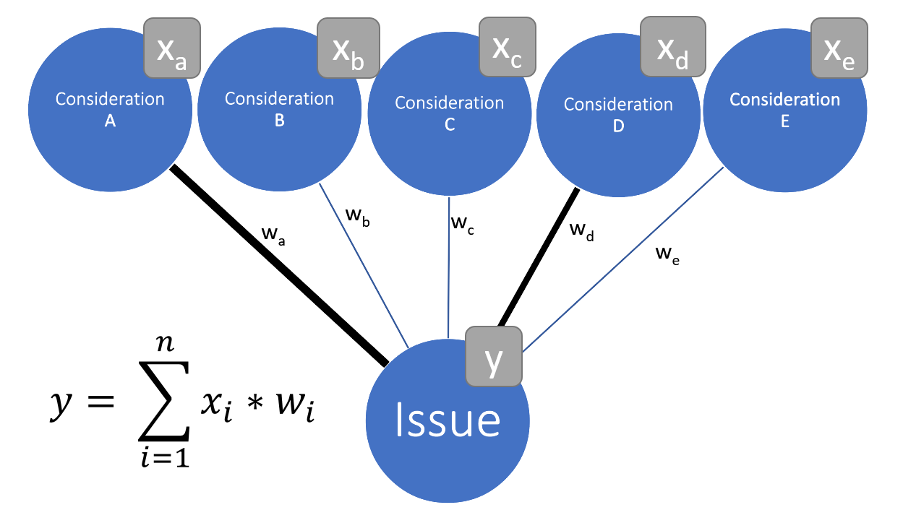

```{r xaringan-themer, include=FALSE, warning=FALSE}
library(xaringanthemer)
style_mono_accent(
  base_color = "#004A95", background_color = "#bfbfbf",
  base_font_size = "32px",
  header_h1_font_size = "1.3rem",
  header_h2_font_size = "1.2rem",
  header_h3_font_size = "1.05rem",
  footnote_font_size = "0.75rem",
  header_font_google = google_font("Lato", '700'),
  text_font_google   = google_font("Lato", "400"),
  code_font_google   = google_font("Fira Mono")
)


```

```{r, load_refs, include=FALSE, cache=FALSE}
library(RefManageR)
BibOptions(check.entries = FALSE, 
           bib.style = "authoryear",
           cite.style = "authoryear",
           style = "markdown",
           hyperlink = FALSE,
           max.names = 2, 
           longnamesfirst = F,
           dashed = FALSE)
myBib <- ReadBib("C:/Users/nicol/Dropbox/Studium/BibTex/PhD.bib", check = FALSE)
```

```{r setup, include=FALSE}

knitr::opts_chunk$set(
  echo = FALSE, 
  message = F, 
  warning = F, 
  cache = T, 
  out.width="90%", 
  fig.height=8, 
  fig.width=15, 
  fig.align='center', 
  eval = T, 
  dev = "svg"
  )
# knitr::opts_knit$set(root.dir = 'C:/Users/nicol/Dropbox/PhD/Papers/Bild/github/bild')

library(tidyverse)
library(dplyr)
library(data.table)
library(fixest)
library(lubridate)
library(patchwork)
library(here)

# load self-made functions
for (filename in list.files(here("code/functions"))){
  source(here(paste0('code/functions/', filename)))
}


```


class: inverse, center, middle

# Framing Effects in the Wild

### Does News Framing Affect Public Opinion?


#### Nicolai Berk<sup>*</sup>

Presentation prepared for the $12^{th}$ Annual Conference of the European Political Science Association in Prague

25.06.2022


.left[.footnote[<sup>*</sup> Dynamics RTG & Humboldt Universität Berlin]]


---

## A classic framing experiment


### Would you support increased welfare spending...

.pull-left[

### in order to support the poor?

```{r hista}

resps <- 
  rnorm(1000, 1.5, 2) %>% 
  round() %>% 
  ifelse(. < -3, -3, .) %>% 
  ifelse(. > 3, 3, .) %>% 
  as_tibble()
  
resps %>% 
  ggplot(aes(x = value)) +
  geom_histogram() +
  xlab("") +
  geom_vline(xintercept = mean(resps$value), lty = 2, col = "red", size = 2) +
  theme_xaringan()

```


]


.pull-right[

### even if it means higher taxes?


```{r histb}

resps <- 
  rnorm(1000, -1.5, 2) %>% 
  round() %>% 
  ifelse(. < -3, -3, .) %>% 
  ifelse(. > 3, 3, .) %>% 
  as_tibble()
  
resps %>% 
  ggplot(aes(x = value)) +
  geom_histogram() +
  xlab("") +
  geom_vline(xintercept = mean(resps$value), lty = 2, col = "red", size = 2) +
  theme_xaringan()

```

]

.footnote[(Very freely after Sniderman and Theriault 2004)]

---

## Are framing experiments externally valid?

<br>

- Plenty of evidence from experiments <font size="5" color="#004A95"> `r Citep(myBib[c("Busby2019", "Leeper2020")])` </font>
- But limited capacity to emulate real world environments <font size="5" color="#004A95"> `r Citep(myBib[c("Barabas2010")])` </font>.
- Strongest theoretical critique: **selective exposure** <font size="5" color="#004A95"> `r Citep(myBib[c("Bennett2008", "Lau2021a")])` </font>.

--

### "A more balanced reading [...] requires methodological diversification, experiments and studies oriented to the world outside” <font size="5" color="#004A95"> `r Citep(myBib[c("Kinder2007")], after = ": 157")` </font>.

---

# Evidence from Observational Studies

<br>

- Few observational studies with mixed findings and endogeneity concerns <font size="5" color="#004A95"> `r Citep(myBib[c("Jerit2008", "Jerit2009")])` </font>.
- Causal inference work not concerned with framing <font size="5" color="#004A95"> `r Citep(myBib[c("Durante2012", "Foos2020", "Martin2017", "Spirig2020")])` </font>.

--

<br>

## No observational studies assessing causal effect of framing!


---

class: inverse, center, middle

# Case

---


## Bild's migration coverage following 2015

.left-column[

```{r bildlogo, out.width = "50%"}

knitr::include_graphics("https://upload.wikimedia.org/wikipedia/commons/thumb/e/e3/Logo_BILD.svg/848px-Logo_BILD.svg.png")

```


]

.right-column[


<br>

- Editorial change in the largest German tabloid newspaper, **Bild**.
- Increasingly **framed migrants as criminals** <font size="5" color="#004A95"> `r Citep(myBib[c("Niggemeier2018Bild")])`</font>.
- Potentially exogenous timing.

]

---

## Bild's migration coverage following 2015


.left-column[


```{r bildlogo2, out.width = "50%"}

knitr::include_graphics("https://upload.wikimedia.org/wikipedia/commons/thumb/e/e3/Logo_BILD.svg/848px-Logo_BILD.svg.png")

```


]

.right-column[

### Interesting because:

- **Clearly identifiable short-term-change** in migration coverage.
- Clear expectations regarding impact (more conservative migration attitudes).
- Change not debated in the media $\rightarrow$__No co-treatment__! <font size="5" color="#004A95"> `r Citep(myBib["Spirig2020"])`</font>.

]


---

<!-- class: inverse, center, middle -->

<!-- # How does this affect migration attitudes? -->

<!-- --- -->


<!-- ## Theoretical Expectations -->


<!-- .pull-left[ -->

<!--  -->

<!-- ] -->


<!-- .pull-right[ -->

<!-- ### Increased exposure to crime frames will lead to... -->
<!-- - H1: **more conservative** attitudes towards migration. -->
<!-- - H2: **stronger association** of crime and migration attitudes. -->

<!-- ] -->

<!-- --- -->

class: inverse, center, middle

# Measurement & Estimation

---

## Frames in Communication

- Collected 2.5M news articles from major German daily newspapers' websites.
- Two-step identification of crime frames:
  1. **Select migration content**:
    + Generate dictionary, oversample migration content.
    + Annotate 1800 articles.
    + Supervised deep-learning model (BERT) to **identify migration content**.
  2. **Select crime frames**.
    + Same procedure.
    + Estimation of crime content **within** migration content.


---

## A sharp, identifiable change in frames in communication

```{r trendplot, cache = F}

TreatmentTrendPlot(size = 2, dpa_corrected = F, palette = c("red", "#004A95")) +
  theme_xaringan()

```


---

## Frames in Mind

### German Longitudinal Election Study (GLES) Panel <font size="5" color="#004A95"> `r Citep(myBib["GLES2017Panel"])`</font>.

**Questions on:**

- [Immigration Attitudes]()
- [Integration Attitudes]()
- [Crime Attitudes]()
- [Support for RR]()
- [Most Important Problem]()

---

## Estimation

### Difference-in-Differences Design


$$y_{it} = \delta * Post_t *  Bild_i + \lambda * Post_t + \rho_i +  \epsilon_{it}$$

.pull-left[

```{r didtheory}

data.frame(
  X = factor(c("pre", "pre", "post", "post", "pre", "post"),
             levels = c("pre", "post")),
  Y = c(1.1, 1.3, 1.5, 1.9, 1.3, 1.7),
  universe = factor(c(rep("counterfactual", 4), rep("factual", 2)),
                    levels = c("counterfactual", "factual")),
  group = factor(c("untreated", "treated", "untreated", 
                   "treated", "untreated", "untreated"),
                 levels = c("treated", "untreated"))
) %>% 
  ggplot(aes(x = X, y = Y, 
             lty = universe, col = group,
             group = paste0(universe, group))) +
  geom_line(size = 2) + 
  geom_point(size = 6) +
  ylab("") + xlab("") +
  theme(axis.text.y = element_blank(), 
        legend.position = "None") +
  theme_xaringan()

```


]

.pull-right[


- Compare those reading *Bild* in W1 to *never*-readers.
- ATT = $\Delta$ attitude Bild readers - $\Delta$ control group.

]

---

class: inverse, center, middle

# Results

---

## Effect on Immigration Attitudes

<br>

```{r singledv, fig.height=3}

DiDPlot(multi = F, scaled = "raw", size = 2) +
  theme_xaringan()


```

.footnote[(Green lines indicate effect equivalent to 5% of scale. Effect size in `r Citep(myBib["Nelson1997Rally"])`: 0.65/11% of scale.)]


---


## Effect of Changing Framing on Alternative DVs


```{r multidv}

DiDPlot(multi = T, scaled = T, size = 2) +
  theme_xaringan()

```

---

## Effect on Migration Attitudes across Waves

```{r migwaves}

DiDByWavePlot(size = 2) +
  theme_xaringan()

```


---

## Effect on other Attitudes across Waves

.pull-left[

### Crime

```{r crimewaves}

DiDByWavePlot("2880h_clean", size = 2) +
  theme_xaringan()

```


]

.pull-left[

### Integration

```{r intwaves}

DiDByWavePlot(dv = "1210_clean", size = 2) +
  theme_xaringan()

```

]

---

## Effect on other DVs across time I


.pull-left[

### AfD Vote

```{r afdwaves}

DiDByWavePlot(dv = "430i_clean", size = 2) +
  theme_xaringan()

```

]

.pull-left[

### MIP: Migration

```{r mipwaves}

DiDByWavePlot(dv = "mip_mig", size = 2) +
  theme_xaringan()

```

]

---

## Association of Immigration and Crime Attitudes

```{r corplot}

MigCrimeCorPlot(size = 2) +
  theme_xaringan()

```

---

## Selecting out

<br>

- No change in association of migration attitudes and Bild readership.
- No differential out-selection across prior attitudes.

---

## Takeaways

<br>

## 1. News framing effects do not easily translate into real world.

- Questions external validity of decades of framing studies.
- Single media outlets have limited influence on public opinion.

## 2. Media effects literature should pay more attention to precise changes in *content*.


---

class: inverse, center, middle

## Fin

### This research is generously funded by

```{r out.width="50%"}


```

```{r out.width="50%"}

knitr::include_graphics("vis/dfg_logo_englisch_blau_en.jpg")

```


---

# Resources I

.footnote[

```{r refs, echo=FALSE, results="asis", cache=FALSE}

PrintBibliography(myBib, end = 4)

```

]


---

# Resources II

.footnote[

```{r refstwo, echo=FALSE, results="asis", cache=FALSE}

PrintBibliography(myBib, start = 5, end = 8)

```

]


---

# Resources III

.footnote[


```{r refsthree, echo=FALSE, results="asis", cache=FALSE}

PrintBibliography(myBib, start = 9)

```

]

---

class: inverse, center, middle

# Appendix

---

## Operationalization DV


.pull-left[


### Immigration Attitudes
- **Opportunities for immigration** of foreigners should be 
  + extended (-3) or
  + restricted (3).
- Asked in **13** waves (1 pre).

]

.pull-right[


### Integration Attitudes
- Foreigners should...
  + completely **adapt to German culture** (-3) or
  + be able to live according to their own culture (3).
- Asked in **4** waves (1 pre)

]

---

## Operationalization DV (continued)

.pull-left[

### Support for radical-right AfD
- Attitude towards **AfD**
  + strongly dislike (-5) to
  + strongly like (5).
- Asked in **14** waves (1 pre)

### MIP: Migration
- Binary indicator, 1 if most important problem is migration.

]

.pull-right[


### Attitude towards crime policy
- "state should get **more competences in fighting crime**, even if this means more surveillance"
  + strongly disagree (1) to
  + strongly agree (5).
- Asked in **4** waves (1 pre)


]
