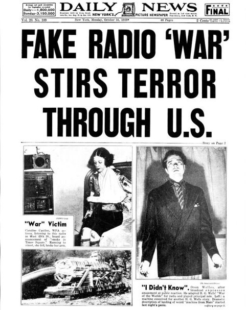
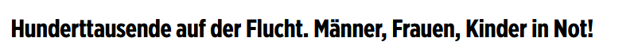
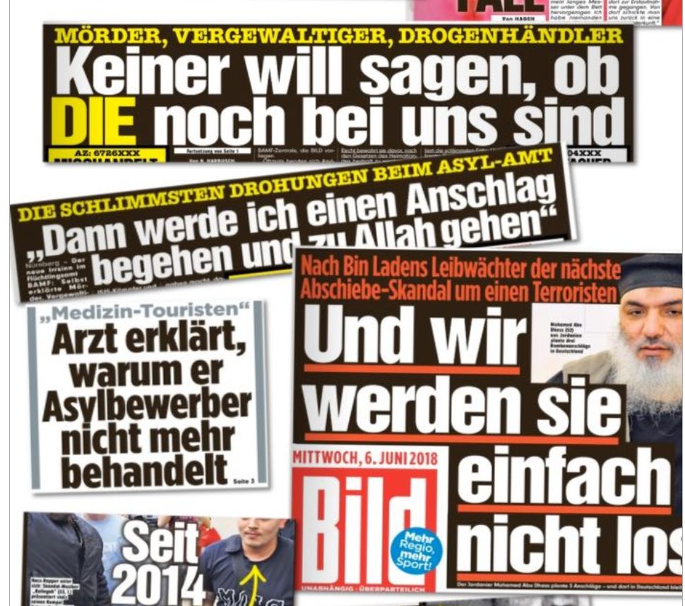
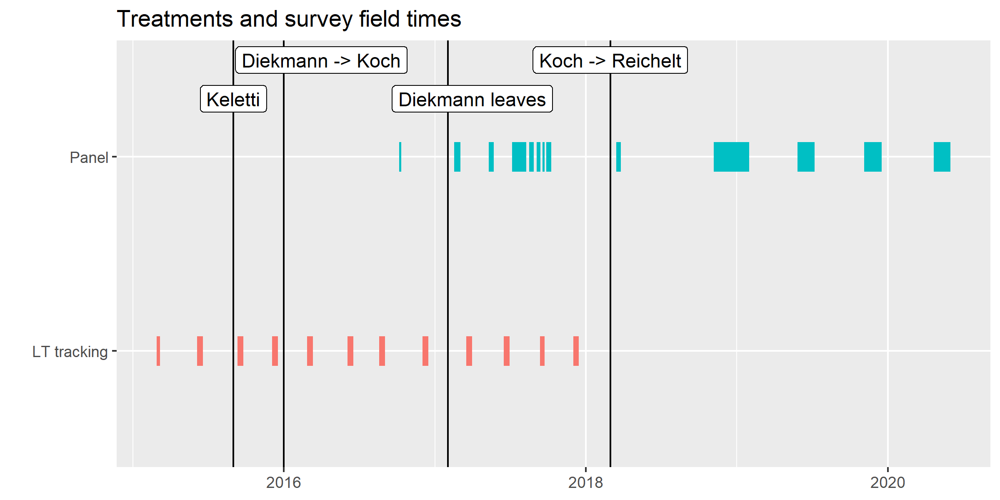
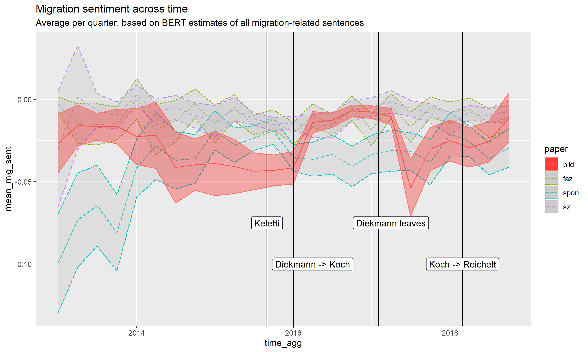
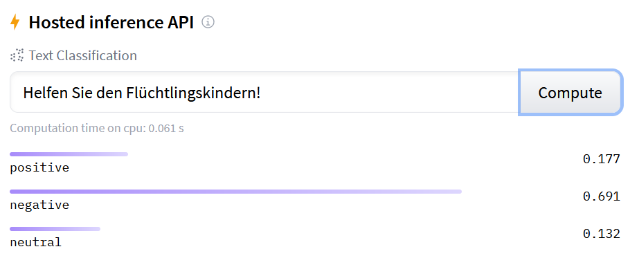
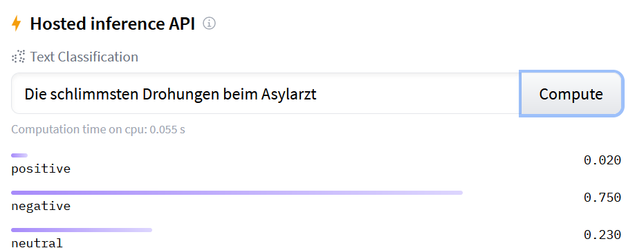
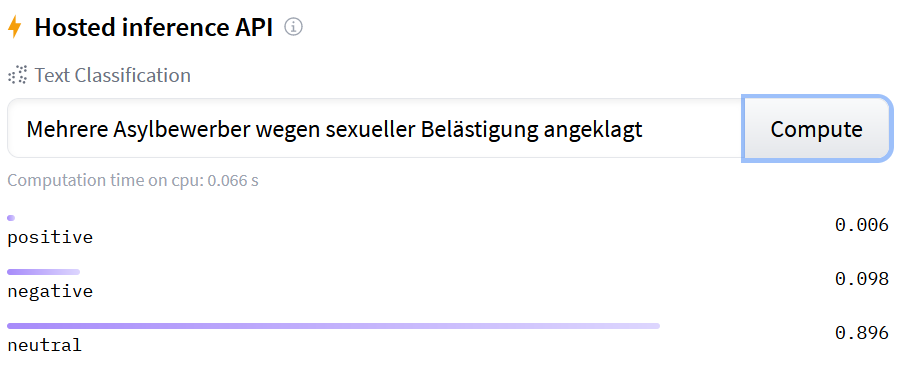

```{r setup, include=FALSE}
knitr::opts_chunk$set(echo = FALSE)
```


# Motivation

## Media effects - maximal or minimal? {.allowframebreaks}

\center

{width=40%} {width=40%}

\flushleft

\framebreak

Maximal paradigm also follows from classic work

- attitude instability [@Converse1962; @Zaller1992]
- framing [@Nelson1997]
- agenda-setting [@McCombs1972]

\framebreak


\center

{width=30%}

\flushleft
  
Minimal effects assumption with increasing media diversity [@Bennett2008]:

- media environment more polarised and more diverse,
- viewers more likely to reject news conflicting with their views,
- viewers can opt for other sources.

$\rightarrow$ strong effects unlikely

\framebreak

Evidence seems to support both views:

### strong media effects on:
- voting behaviour [@Boomgaarden2009; @Devine2020; @Ladd2009a],
- issue agenda [@King2017],
- attitudes [@Nelson1997; @Foos2020]

### weak or no effects on:
- voting behaviour [@Gentzkow2011],
- issue agenda [@Lau2021],
- attitudes [@Guess2021].


# Moderators

## Towards a theory of conditioning factors

Recently more discussion of moderators

- Mostly based on expectations regarding source:
  + Discounting of biased news [@Chiang2011a]
  + Rejection of partisan takeovers [@Spirig2020]
- facing biased new media outlets doesn't seem to affect citizens [@Guess2021]

## Open questions:

- What about outlets currently consumed changing their commentary?
- What about individual-level factors?
  + political knowledge, opinion strength [@Zaller1992]?
  + media diet [@Bennett2008]?
  + partisan identification [@Taber2006]?
- Is attitude change a result of changing issue definitions [@Ajzen2000; @Nelson1997]?


# The case


- In fall of 2015, major German tabloid Bild started calling for support for incoming refugees.
- This was a major deviation from the papers' agitative history.




## 2016 onwards the framing changed

\center
{height=50%}

## Logic of the paper

- I argue this represents a natural experiment to study migration framing,
- allowing to identify the *causal* impact of news framing on:
  + migration opinions, 
  + and issue definitions.
- especially interesting case:
  + instead of treatment with a new source [@Guess2021], cue-taking (from the newspaper) can be expected.
  + expectation of change in bias among readers unlikely [@Chiang2011a; @Spirig2020]

*$\rightarrow$ strong expectations for framing effect!*

# Data and research design

## The GLES offers a number of possible data sources:
- Longterm-tracking, 
  - N $\approx$ 1000, 
  - four times/year, 
  - 2009-17
- Panel, 
  - N $>$ 10,000, 
  - clustered around election

Both regularly contain questions on

- news consumption,
- migration/integration attitudes,
- open-ended MIP.


## Treatments and Field Dates {.allowframebreaks}

Journalists ascribe change to changing editors. This leaves us with a total of 4 possible treatments:

1. Summer of 2015
2. Diekmann replaced as editor-in-chief by Tanit Koch in 2016, 
3. Diekmann finally left Bild in February 2017,
4. Koch replaced by Julian Reichelt in January 2018.

Not entirely clear which treatment is relevant -> assess changing framing in the newspaper!

\framebreak



## Treatment selection

1. Pre-select migration content with supervised classifier.

2. Several possible approaches for treatment identification:

  - inductive frame identification (FA/STM)
  - dictionary for frames (humanitarian/crime/...)
  - sentiment towards migration

3. Treatment identified where parallel paths diverge


## Modelling

Diff-in-Diff:

\center

$$ y = \beta_1 * T + \beta_2 * B + \beta_3 * T * B $$

- DVs: migration attitudes & issue definitions
- Additional interactions for individual-level moderators.


## Measuring issue definitions

### Embedding regression [@Rodriguez2020]

- applicable in low-N environments.
- pre-existing word embeddings to understand how different groups communicate about migration.
- assess associations with migration in the MIP answers.

## Fin

\center \Large Thank you for your attention!

# Appendix

## A preliminary effort at sentiment identification {.allowframebreaks}

- identify sentences mentioning terms from migration dictionary.
- estimate sentiment of these sentences with German BERT sentiment classifier [@Guhr2020].
- Trained to classify a variety of German text (wiki, reviews, tweets, ...) into positive, neutral, and negative content



\framebreak

However, unclear what this really measures:

{width=45%} {width=45%}

{width=45%} {width=45%}

\framebreak

Takeaways:

- wait for supervised coding.
- focus on specific frames.
- measure association.


# Resources

## Resources {.allowframebreaks}
